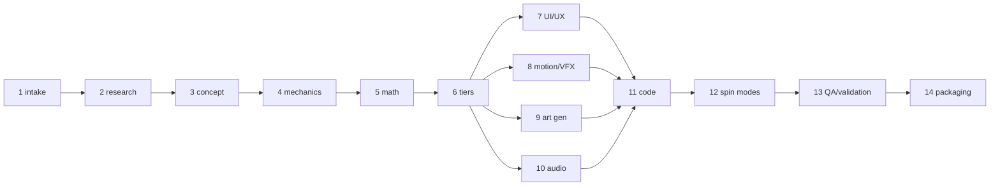

# single-modern-slot-creator v1.0.0

A Claude Code skill package. **One invocation designs, calculates, asset-generates, implements,
simulates, and packages exactly one complete, original, production-prototype online slot game.**

Explicitly **out of scope** (CONVENTIONS §1): casino company, lobby, multi-game platform, player
accounts, KYC/AML, payments, affiliates, operator back office, multiple finished games per run.
If you ask for any of those, the skill stops and says so.

## Quick start

### Install for Claude Code

Globally (available in every project) — from a clone of this repo:

```powershell
# Windows PowerShell — junction, so the skill tracks repo updates
# (run from the repo root; $PWD is this clone)
New-Item -ItemType Junction `
  -Path "$env:USERPROFILE\.claude\skills\single-modern-slot-creator" `
  -Target "$PWD"
```

```bash
# bash/zsh (macOS, Linux) — run from the repo root
ln -s "$(pwd)" ~/.claude/skills/single-modern-slot-creator
```

Or copy instead of linking (`Copy-Item -Recurse` / `cp -r`) for a frozen snapshot. For a single
project, place the same directory at `<project>/.claude/skills/single-modern-slot-creator`.

### Invoke

Freeform, inside any Claude Code session:

> create a slot game about deep-sea hydrothermal vents

Or hand it a structured brief that validates against `schemas/skill-input.schema.json`. Every
field is optional; `"AUTO"` (or omission) delegates the decision to the skill, which logs its
choice in the generated `docs/assumption-log.md`. Minimal example:

```json
{
  "project":  { "gameName": "AUTO", "targetJurisdictions": ["MT"] },
  "creative": { "theme": "clockwork carnival", "mood": "whimsical" },
  "math":     { "targetRtp": 0.96, "volatility": "high", "maximumWinXBet": 10000 }
}
```

`{}` is also a valid brief — the skill picks the default game shape (5×4, RTP 0.9600, high
volatility, 10,000x max win; CONVENTIONS §11).

## What one run produces

A skill run creates `games/<slug>/` in the host project (CONVENTIONS §3):

```
games/<slug>/
├── README.md                     # per-game front door: headline math, how to run
├── artifact-manifest.json        # every file + sha256 + provenance
├── docs/                         # game-design-document, par-sheet, art-style-bible,
│                                 # motion-specification, audio-specification,
│                                 # compliance-review, validation-report,
│                                 # assumption/decision logs, risk-register,
│                                 # source-register, known-limitations
├── config/                       # 15 JSON files (game-config, symbols, paytable,
│                                 # reel-sets, scatter-tiers, features, bonus-buys,
│                                 # spin-presentation, autoplay, jurisdiction-policies,
│                                 # state-machine, animation-events, audio-events,
│                                 # asset-manifest, device-profiles) — each MUST
│                                 # validate against its schema in schemas/
├── math/                         # specialized copy of the math/ template (uv package)
│   └── reports/                  # simulation-report.json + PAR sheet outputs
├── client/                       # specialized copy of client-template/ (bun + TS + PixiJS)
├── assets/
│   ├── art/                      # generated images (png source of truth)
│   ├── atlas/                    # packed atlases + .json
│   └── audio/                    # generated/placeholder audio
└── prompts/
    ├── art-prompts.json          # every image prompt, schema-validated
    ├── audio-prompts.json        # ElevenLabs/Stable-Audio-class SFX + music prompts
    └── blender/                  # *.py scripts runnable via blender --background --python
```

## Pipeline overview

Fourteen steps, each with a prompt file, a role charter, and a **gate** that must pass before
the next step starts (max 3 fix attempts, then the failure is recorded honestly and the run
stops). Full gate checklists live in `SKILL.md` and the individual prompt files.

| # | Step | Prompt | Role | Gate (summary) |
|---|------|--------|------|----------------|
| 1 | Intake & normalization | `SKILL.md` | skill-orchestrator | brief normalized, assumptions logged |
| 2 | Focused research | `prompts/research.md` | strategist | ≥8 dated sources, IP-risk list present |
| 3 | Concept & theme (3 → 1) | `prompts/concept.md` | strategist | 3 scored candidates, 1 original theme selected |
| 4 | Archetype & mechanics | `prompts/mechanics.md` | strategist | 1 primary + ≤3 supporting mechanics, no trademarked names |
| 5 | Math model & simulation | `prompts/math.md` | mathematician | configs schema-valid, RTP within tolerance, PAR sheet complete |
| 6 | Three-tier scatter bonus | `prompts/math.md` §6 | mathematician | tiers materially different in math AND presentation |
| 7 | Immersive UI/UX spec ∥ | `prompts/ui-ux.md` | creative-director | every screen × 5 layouts, 10 component states |
| 8 | Motion/animation/VFX ∥ | `prompts/animation-vfx.md` | creative-director | every event fully specified, skip cannot alter outcomes |
| 9 | Art generation ∥ | `prompts/art-generation.md` | creative-director | prompts cover asset manifest, provenance recorded |
| 10 | Audio spec & prompts ∥ | `prompts/audio-generation.md` | creative-director | every animation `audioEvent` exists, all music states |
| 11 | Code integration | `prompts/code-integration.md` | mathematician + orchestrator | `bun install && bun run typecheck && bun test` green |
| 12 | Spin-speed/skip/autoplay | `prompts/code-integration.md` §7 | orchestrator | mode-equivalence proof, autoplay stop conditions |
| 13 | Simulation, QA & validation | `prompts/validation.md` | compliance-qa | full test matrix, honest pass/fail report |
| 14 | Final packaging | `SKILL.md` §Packaging | orchestrator | all deliverables + sha256 manifest + limitations |



Steps 7–10 depend on 3–6 but are independent of each other and run in parallel.

## Requirements

- **Bun ≥ 1.2** — all TypeScript/client work (`bun install`, `bun test`, `bun run build`).
  npm/yarn/pnpm are never used.
- **uv ≥ 0.6** — all Python/math work (`uv sync`, `uv run pytest`,
  `uv run python -m slot_math.simulate …`). uv manages Python itself; no bare `pip`/`python`.
- **Optional MCP servers** (the skill degrades gracefully when they're absent):
  - `imagegen` (`mcp__imagegen__*`) — actual image generation. Absent → the run still writes
    `prompts/art-prompts.json` with every prompt and notes prompt-only status in the
    validation report.
  - Blender (`mcp__blender__*`) — 3D hero assets, turntable sprite sheets, parallax depth
    layers, normal-map bakes. Absent → equivalent standalone scripts are still written to
    `prompts/blender/*.py`, runnable later via `blender --background --python <file>`.
  - Audio generation has no MCP binding: `prompts/audio-prompts.json` is always emitted, and
    the client ships a silent-safe audio manager so the game runs with missing audio files.

## Repo map

| Path | Purpose |
|------|---------|
| `SKILL.md` | Skill entry point: frontmatter, 14-step execution model, gates, packaging rules |
| `CONVENTIONS.md` | Binding contract for every file here and every generated artifact — wins all conflicts |
| `prompt.txt` | Original mission brief (read-only reference; do not edit) |
| `agents/` | 5 role system prompts: strategist, mathematician, creative-director, compliance-qa, skill-orchestrator |
| `prompts/` | 10 step prompts consumed during execution (research → validation) |
| `schemas/` | 18 JSON Schemas (draft 2020-12) every config and manifest must validate against |
| `templates/` | 8 document templates (GDD, PAR sheet, style bible, motion/audio specs, compliance, validation, manifest) |
| `research/` | Source-backed research dossier (see below) |
| `math/` | uv-managed Python simulation package TEMPLATE (`slot_math`) — copied and specialized per game |
| `client-template/` | Bun + strict TypeScript + PixiJS v8 client TEMPLATE — deterministic core, copied per game |
| `.build/` | Build machinery for this skill package itself — safe for users to ignore |

## Research foundation

Everything the skill decides is grounded in `research/` — a dated, source-tagged dossier set.
Start with `00-executive-summary.md`; agents consult domain files as each step needs them.

| File | Topic |
|------|-------|
| `00-executive-summary.md` | One-file orientation synthesizing dossiers 01–13 |
| `01-slot-archetypes.md` | Win-evaluation archetypes: math complexity, volatility, layout, risk |
| `02-mechanics-and-features.md` | Modern mechanics incl. the 3/4/5-scatter bonus-tier hierarchy |
| `03-slot-math-and-simulation.md` | PAR sheets, RTP decomposition, volatility, simulation reproducibility |
| `04-technical-standards-rng-integrity.md` | GLI-11/19, RNG requirements, recovery, certification |
| `05-jurisdiction-rules.md` | Per-jurisdiction rules: autoplay, turbo, bonus buy, round duration |
| `06-frontend-tech.md` | HTML5 renderers, animation, audio, assets, performance budgets |
| `07-rgs-architecture.md` | Server-authoritative round lifecycle, manifests, idempotency, recovery |
| `08-ui-ux-conventions.md` | HUD anatomy, layouts, controls, immersion, accessibility |
| `09-motion-vfx.md` | Animation/VFX systems and spin-presentation modes |
| `10-art-pipeline.md` | AI-first slot art and asset generation pipeline |
| `11-audio-pipeline.md` | Adaptive music states, stingers, SFX, win-tier audio |
| `12-market-patterns-ip.md` | What top studios shipped 2024–2026; hit-game math profiles |
| `13-responsible-design-accessibility.md` | Dark-pattern prohibitions, reality checks, WCAG 2.2 |
| `14-mechanic-compatibility-matrix.md` | Archetype × mechanic compatibility with complexity scores |
| `16-ip-risk-register.md` | Protected/licensed mechanic names (e.g. "Megaways"), AI-art provenance |
| `17-jurisdiction-policy-matrix.md` | Feature-flag matrix seeding `config/jurisdiction-policies.json` |

(Numbering intentionally skips 15; dossiers 14/16/17 are synthesized from the primary set.)

## Math & fairness guarantees

Encoded in `CONVENTIONS.md` §5/§7/§9 and enforced by tests in `math/` and `client-template/`:

- **Server-authoritative outcomes.** The client is a pure renderer of a committed outcome
  manifest; it never determines, predicts, or alters a result. The bundled dev round provider
  is seeded, clearly flagged dev/test-only, and throws in production builds.
- **Integer minor units.** All settlement money is integer (`*Minor` fields); pays are integer
  hundredths of a bet (`payX100`) with a single floor division — identical rule in the Python
  simulator and the TypeScript client. No binary floats touch settlement.
- **Fixed, versioned math.** No player-adaptive RTP, no behavioural odds, no fake wins, no
  forced near-misses; `gameVersion`/`mathVersion`/`configHash` pin every build.
- **Presentation-only speed modes.** Normal/quick/turbo/skip/autoplay/recovery change timing
  only; `client-template/tests/equivalence.test.ts` proves the same manifest yields identical
  final results in every mode.
- **Three materially distinct tiers.** 3 scatters → `feature`, 4 → `super_feature`,
  5+ → `ultimate_feature`, each with separate math and simulation results.
- **Reproducible simulation.** Every report records gameVersion, mathVersion, configHash,
  sim code version, lockfile hash, seeds, rounds, workers, and the exact command.
- **Bounded liability.** Max-win cap enforced in math and engine (`max_win_termination`);
  cascade and retrigger caps with proven termination.

**Honest limits** (CONVENTIONS §9.9 — read before any real-money use):

- Outputs are **production prototypes / certification-ready candidates — NOT certified**.
- Real-money release additionally requires: jurisdiction-specific **legal review**,
  **independent math verification**, **laboratory certification** (GLI or equivalent), and
  **operator UAT**.
- The dev round provider and dev/sim RNGs are never a substitute for a real RGS.

## Known limitations

- Generated games are prototypes: art/audio quality depends on available generation tools,
  and release-grade simulation sizes (hundreds of millions of rounds) are the user's call —
  default runs are smaller.
- `CONVENTIONS.md` §2 lists an `examples/example-single-slot/` directory that is not yet
  present in this package; treat generated games as the working examples for now.
- `.build/` contains the machinery used to author and verify this skill package (detached
  build jobs, results). It is not consumed at skill runtime and users can ignore it.
