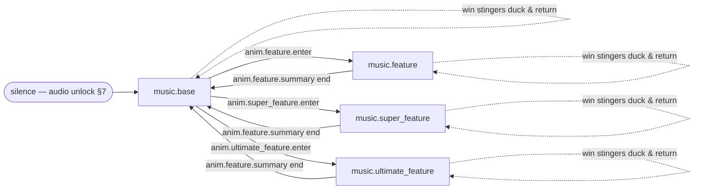

# Audio Specification — Belladonna's Parlour

| Field | Value |
|---|---|
| Game name | Belladonna's Parlour |
| Project slug | belladonna-parlour |
| Game version | 0.1.0 |
| Math version | 0.1.0 |
| Config hash | (pending — set after config/ freeze, step 13; computed per CONVENTIONS §5) |
| Date | 2026-08-08 |
| Generator | single-modern-slot-creator v1.0.0 |

---

## 1. Audio direction

- **Sonic identity (one sentence):** A chamber-noir waltz — harpsichord, low strings and glass
  harmonica in a candle-lit parlour after midnight — where every game sound is glass, liquid,
  cork, brass or paper, and escalation is achieved by adding instruments, never by getting louder.
- **Instrumentation / sound palette:** harpsichord, pizzicato and bowed low strings, glass
  harmonica, cimbalom, low brass (super tier only), wordless choir and harp (ultimate tier only);
  SFX palette restricted to physical textures: glass (bottles, pings, shatters), liquid (pours,
  draws, overflows), cork (pops, stoppers), brass (latches, clockwork, seals), paper (ledger,
  wax-sealed letters). No synthesizers, no drum kits, no coin cascades.
- **Tempo & key plan:** ONE tempo family — **72 BPM, 3/4 time** — across all four music states
  (one bar = 2,500 ms exactly). Keys stay in the D-minor family: base **Dm**, feature **Dm**,
  super_feature **Gm** (subdominant minor — darker, harmonically adjacent), ultimate_feature
  **Dm** (nocturne). The super tier's "~+8 BPM feel" comes from arrangement (cimbalom
  sixteenth-note subdivision, cello ostinato), never a tempo jump, so every transition, stem and
  the count-up loop stay mixable on one bar grid.
- **Intensity layering:** the three feature-tier states each ship a vertical stem set keyed to
  the master-vial bank P (§2.2). Layering is presentation only: it reads the committed outcome
  manifest's per-step `ext.multiplierBank100` and never predicts or implies anything about
  uncommitted results.

## 2. Music-state graph

### 2.1 States & transitions

Exactly four music states per CONVENTIONS §4.3, plus `silence` (boot/error):



Win stingers and the count-up loop are one-shots that duck the active state and return to it;
they are never states. There is no tier-upgrade path in this design (tier is fixed by the
initial-grid seal count — GDD §7), so no feature→super/ultimate music edges exist.

| # | From | To | Trigger | Rule |
|---|---|---|---|---|
| T1 | base | feature | `anim.feature.enter` | quantize to next **bar boundary** (2,500 ms grid on the shared `AudioContext` clock), **250 ms equal-power crossfade**, `sfx.feature.enter` stinger covers the seam |
| T2 | base | super_feature | `anim.super_feature.enter` | as T1, `sfx.super_feature.enter` covers the seam |
| T3 | base | ultimate_feature | `anim.ultimate_feature.enter` | **hard-cut permitted** (the only state allowed to hard-cut, plus `sfx.win.max`): music stops on the bar boundary, `sfx.ultimate_feature.enter` plays over silence, nocturne enters on its downbeat |
| T4 | any tier | base | end of `anim.feature.summary` | next bar boundary, 250 ms crossfade, no stinger (the summary flourish has already resolved) |
| T5 | any | silence | `error` state entry | immediate 250 ms fade-out; `ui.error` plays over silence |
| T6 | any | `sfx.win.max` | `max_win_termination` step | everything stops (duck −60 dB); the max-win piece owns the session; on its end, T4 logic applies |

Beat math at 72 BPM 3/4: beat = 833.33 ms, bar = 2,500 ms, every music loop is 32 bars =
80,000 ms exactly. The scheduler computes `timeToNextBar = barLength − (ctx.currentTime −
stateStartTime) mod barLength` and schedules both sources with `AudioBufferSourceNode.start(when)`.

**Integrity rule:** the graph reacts ONLY to the committed outcome manifest. No transition, stem
or riser fires before its outcome step is committed; nothing implies player input can affect a
committed result; slam/quick/turbo cues never fire where `jurisdiction-policies.json` forbids
them (GB: RTS 14E).

### 2.2 Vertical intensity layer — keyed to the P bank

Each feature-tier state is a stem set at identical BPM (72), time signature (3/4), key and
sample length (80,000 ms, bar-aligned). The base layer (`-l1`, the delivered
`music-<state>.webm`) is always on; three intensity stems fade in as the master vial fills,
reading P from the committed step's `ext.multiplierBank100`:

| Stem | Content (per state) | Fades in at | Fade |
|---|---|---|---|
| `-p5` | essence pulse: pizzicato/celesta eighth-note pulse | **P ≥ 5** | 1 bar (2,500 ms) linear |
| `-p15` | glass arpeggios: glass-harmonica/harp figures | **P ≥ 15** | 1 bar |
| `-p40` | deep swell: choir/low-string pedal, prism shimmer | **P ≥ 40** | 1 bar |

Stems never fade out mid-feature (P is monotonic; cap ×512) and reset at feature exit. Base game
has no P bank, so `music.base` ships no stems. Stem files are generation targets in
`prompts/audio-prompts.json` (ids `music-feature-p5` … `music-ultimate-feature-p40`); they are
mixer layers of their parent event, not separate audio events, so they carry no entry in
`config/audio-events.json`. Low device tier drops stems first (§5).

### 2.3 State sound

| State | Character |
|---|---|
| `music.base` | sparse 3/4 parlour waltz ~72 BPM: solo harpsichord motif, pizzicato low strings on beats 2–3, distant clock, rain texture — elegant menace, unhurried |
| `music.feature` | The Tasting: same motif, adds steady pizzicato pulse and soft cimbalom shimmer — conspiratorial warmth (Dm) |
| `music.super_feature` | The Distillery: low brass swells, driving cimbalom sixteenths, darker chromatic harmony, cello ostinato — ~+8 BPM *feel* via arrangement, tempo unchanged (Gm) |
| `music.ultimate_feature` | The Night Garden: **exclusive nocturne**, not a louder base loop — glass-harmonica lead, wordless choir pads, harp arpeggios (Dm) |

## 3. Bus structure & mixing rules

### 3.1 Buses

```
music ─┐
amb   ─┤
sfx   ─┼─► master ─► DynamicsCompressorNode limiter (threshold −3 dB, ratio 12:1, knee 0) ─► destination
ui    ─┘
```

| Bus | Contents | Default gain | Notes |
|---|---|---|---|
| `master` | all | 0 dB | true-peak ceiling −1 dBTP via limiter |
| `music` | `music.*` | 0 dB | duck target per §3.3 |
| `amb` | `amb.*` | −6 dB | parlour room tone |
| `sfx` | `sfx.*` | 0 dB | outcome & feedback sounds |
| `ui` | `ui.*` | −4 dB | interaction sounds |

Voice management: global mixer cap **16 voices**, steal lowest-priority-oldest; per-event
polyphony per the inventory (§4) — shatter chains cap **6**, orb pings cap **4**. Priorities
(schema 0–100, 100 = never steal): music states + `sfx.win.max` = 100; critical result cues,
tier entries, prisming, maxwin, error/reconnect = 80; win/feature sfx = 60; reel/symbol/
mechanic = 40; UI + ambience = 20.

### 3.2 Loudness targets

| Content | Target |
|---|---|
| Full mix, typical session (integrated) | **−16 LUFS** |
| Music beds (delivered files, integrated) | −16 LUFS |
| Ambience bed | −22 LUFS |
| Win/tier stingers (short-term max) | **−14 LUFS** |
| Max-win pieces (`sfx.win.max`, `sfx.maxwin.reached`) | **−13 LUFS** |
| True peak, every delivered file | **≤ −1.0 dBTP** (mastering constraint on every asset; lossy encode headroom) |
| Loudness range | ≤ 12 LU practical (long repetitive sessions) |

Escalation is by texture and layer count, never by level: `max` is only 3 LU above the session
average.

### 3.3 Ducking matrix

Sidechain gain on the target bus while the trigger plays; encoded per event on its `ducking`
field in `config/audio-events.json`. Standard envelope **attack 40 ms / release 400 ms** unless
noted.

| Trigger | Target | Amount | Attack | Release |
|---|---|---|---|---|
| `sfx.reel.stop` | `music.*` | −3 dB | 40 | 150 |
| `sfx.scatter.land` | `music.*` | −3 dB | 40 | 400 |
| `sfx.scatter.anticipation` | `music.*` | −6 dB | 200 | 400 |
| Win sfx (`sfx.win.medium/big/mega/epic`) | `music.*` + `amb.*` | **−8 dB** | 40 | 400 |
| `sfx.win.countup_loop` (held for sequence) | `music.*` + `amb.*` | −8 dB | 40 | 800 |
| Tier entries (`sfx.feature.enter`, `sfx.super_feature.enter`, `sfx.ultimate_feature.enter`) | `music.*` + `amb.*` | **−10 dB** | 40 | 400 |
| `sfx.maxwin.reached` | `music.*` + `amb.*` | −10 dB | 40 | 400 |
| `sfx.win.max` | everything else | −60 dB (stop) | 40 | 800 |
| `sfx.prisming.chime` | `music.*` | −8 dB (GDD §6.3) | 40 | 400 |
| `sfx.feature.retrigger` | `music.*` | −6 dB | 40 | 400 |
| `sfx.feature.summary` | `music.*` | −8 dB | 40 | 400 |
| `ui.error` | `music.*` + `amb.*` | −6 dB | 40 | 300 |
| **`sfx.win.small`** | **nothing** | — | — | — |

`sfx.win.small` ducks NOTHING by design — it doubles as the LDW result cue (§6).

## 4. Audio-event inventory

36 events; every row maps 1:1 to `config/audio-events.json` (schema-validated, gate G10). All
events: primary `assets/audio/<file>.webm` (Opus 48 kHz) + `.m4a` AAC `mobileFallback`;
`focusLoss` = pause except where noted; full field set (loop points, priority, polyphony,
volumeDb, LUFS, ducking, interrupt, reduced-sensory, animation link, generation prompt) in the
config.

| Event | eventId | file | dur ms | loop | prio | poly | duck | animEvent |
|---|---|---|---|---|---|---|---|---|
| Base music | `music.base` | `music-base.webm` | 80000 | 0→80000 | 100 | 1 | — | — |
| Tasting music | `music.feature` | `music-feature.webm` | 80000 | 0→80000 | 100 | 1 | — | — |
| Distillery music | `music.super_feature` | `music-super-feature.webm` | 80000 | 0→80000 | 100 | 1 | — | — |
| Night Garden nocturne | `music.ultimate_feature` | `music-ultimate-feature.webm` | 80000 | 0→80000 | 100 | 1 | — | — |
| Parlour ambience | `amb.parlour` | `amb-parlour.webm` | 45000 | 0→45000 | 20 | 1 | — | — |
| Column stop | `sfx.reel.stop` | `sfx-reel-stop.webm` | 300 | no | 40 | 6 | music −3 | `anim.reel.stop` |
| Bottle land | `sfx.symbol.land` | `sfx-symbol-land.webm` | 250 | no | 40 | 4 | — | `anim.symbol.land` |
| Seal land | `sfx.scatter.land` | `sfx-scatter-land.webm` | 1000 | no | 60 | 2 | music −3 | `anim.scatter.land` |
| Seal anticipation riser | `sfx.scatter.anticipation` | `sfx-scatter-anticipation.webm` | 2500 | 0→2500 | 60 | 2 | music −6 | `anim.scatter.anticipation` |
| Bottle shatter | `sfx.cascade.shatter` | `sfx-cascade-shatter.webm` | 600 | no | 40 | **6** | — | `anim.cascade.remove` |
| Cascade settle | `sfx.cascade.settle` | `sfx-cascade-settle.webm` | 700 | no | 40 | 2 | — | `anim.cascade.refill` |
| Essence orb land | `sfx.orb.land` | `sfx-orb-land.webm` | 400 | no | 40 | **4** | — | `anim.orb.land` |
| Essence draw | `sfx.orb.collect` | `sfx-orb-collect.webm` | 600 | no | 40 | 4 | — | `anim.orb.collect` |
| Vial pour | `sfx.orb.apply` | `sfx-orb-apply.webm` | 900 | no | 60 | 1 | — | `anim.orb.apply` |
| The Prisming | `sfx.prisming.chime` | `sfx-prisming-chime.webm` | 1500 | no | 80 | 1 | music −8 | `anim.ultimate_feature.prisming` |
| Tasting entry (3 seals) | `sfx.feature.enter` | `sfx-feature-enter.webm` | 2500 | no | 80 | 1 | music+amb −10 | `anim.feature.enter` |
| Distillery entry (4 seals) | `sfx.super_feature.enter` | `sfx-super-feature-enter.webm` | 3000 | no | 80 | 1 | music+amb −10 | `anim.super_feature.enter` |
| Night Garden entry (5 seals) | `sfx.ultimate_feature.enter` | `sfx-ultimate-feature-enter.webm` | 3500 | no | 80 | 1 | music+amb −10, hard-cut | `anim.ultimate_feature.enter` |
| Retrigger | `sfx.feature.retrigger` | `sfx-feature-retrigger.webm` | 1500 | no | 60 | 1 | music −6 | `anim.feature.retrigger` |
| Chamber summary | `sfx.feature.summary` | `sfx-feature-summary.webm` | 3000 | no | 60 | 1 | music −8 | `anim.feature.summary` |
| Small win / LDW result | `sfx.win.small` | `sfx-win-small.webm` | 500 | no | 80 | 1 | **none** | `anim.win.small` |
| Medium win | `sfx.win.medium` | `sfx-win-medium.webm` | 1500 | no | 60 | 1 | music+amb −8 | `anim.win.medium` |
| Big win | `sfx.win.big` | `sfx-win-big.webm` | 2500 | no | 60 | 1 | music+amb −8 | `anim.win.big` |
| Mega win | `sfx.win.mega` | `sfx-win-mega.webm` | 3000 | no | 60 | 1 | music+amb −8 | `anim.win.mega` |
| Epic win | `sfx.win.epic` | `sfx-win-epic.webm` | 7500 | no | 60 | 1 | music+amb −8 | `anim.win.epic` |
| Maximum win piece | `sfx.win.max` | `sfx-win-max.webm` | 10000 | no | **100** | 1 | all −60 | `anim.maxwin.reached` |
| Count-up loop | `sfx.win.countup_loop` | `sfx-win-countup-loop.webm` | 2500 | 0→2500 | 60 | 1 | music+amb −8 held | `anim.win.countup` |
| Count-up terminator | `sfx.win.countup_end` | `sfx-win-countup-end.webm` | 1250 | no | 60 | 1 | — | `anim.win.countup_end` |
| Vial overflow (cap) | `sfx.maxwin.reached` | `sfx-maxwin-reached.webm` | 2500 | no | 80 | 1 | music+amb −10 | `anim.maxwin.reached` |
| Autoplay start † | `sfx.autoplay.start` | `sfx-autoplay-start.webm` | 400 | no | 20 | 1 | — | `anim.autoplay.start` |
| Autoplay stop † | `sfx.autoplay.stop` | `sfx-autoplay-stop.webm` | 400 | no | 20 | 1 | — | `anim.autoplay.stop` |
| Button press | `ui.click` | `ui-click.webm` | 120 | no | 20 | 2 | — | `anim.ui.spin_pressed` |
| Bet change | `ui.bet_change` | `ui-bet-change.webm` | 150 | no | 20 | 2 | — | — |
| Toggle | `ui.toggle` | `ui-toggle.webm` | 150 | no | 20 | 2 | — | — |
| Error | `ui.error` | `ui-error.webm` | 800 | no | 80 | 1 | music+amb −6 | `anim.system.error` (focusLoss: continue; reduced-sensory: unchanged) |
| Reconnect | `ui.reconnect` | `ui-reconnect.webm` | 600 | no | 80 | 1 | — | `anim.system.reconnect` (focusLoss: continue; reduced-sensory: unchanged) |

† jurisdiction-gated (§10).

### 4.1 Mechanic-conditional events & id notes

- Mechanic coverage: cascades → `sfx.cascade.shatter` (+1 semitone runtime pitch per chain
  depth, cap +12 — GDD §6.1) / `sfx.cascade.settle`; summed-orb multiplier →
  `sfx.orb.land/collect/apply` (orb-land pitch scales with value band); prisming doubler →
  `sfx.prisming.chime`. No WILD, no jackpot, no grid expansion, no respins, no mystery symbols
  exist in this design, so no such audio events exist (GDD §4, §6).
- Escalating seal stingers: the 3/4/5-seal trigger stingers ARE the tier entry events
  (`sfx.feature.enter` → `sfx.super_feature.enter` → `sfx.ultimate_feature.enter`), built on
  rising glass-harmonica intervals (minor 3rd → perfect 5th → octave) so each seal count is
  audibly "more" by length, interval width and layer count — never just volume.
- Scatter pitch-stepping: `sfx.scatter.land` is pitch-stepped +1 semitone per seal index at
  runtime; the anticipation riser (§2.3 of the motion spec) fires only while the committed
  outcome still permits reaching the next tier threshold — never on dead boards.
- **Canonical-id respelling (build-run note):** the run-plan id list named
  `sfx.win.countup.loop`, `sfx.win.countup.end` and `ui.bet.change`; those spellings have too
  many dot-segments for the schema's eventId grammar (`sfx.<context>.<name>` / `ui.<name>`,
  CONVENTIONS §4.3), so they ship as **`sfx.win.countup_loop`**, **`sfx.win.countup_end`** and
  **`ui.bet_change`**. No config or code referenced the dotted spellings
  (`config/animation-events.json` audited: zero references), so nothing dangles.

## 5. File format defaults

| Property | Default |
|---|---|
| Delivery format | **WebM Opus** (`.webm`) primary; **`.m4a` AAC** fallback per event (`mobileFallback`) — covers Safari/iOS < 18.4; MP3 never used for loops (frame-padding gaps) |
| Sample rate | 48,000 Hz throughout (never mixed rates) |
| Bit rate | music/amb Opus 96 kbps (AAC 160 fallback); sfx/ui Opus 64 kbps (AAC 128 fallback) |
| Channels | music/amb stereo; sfx/ui mono |
| Max sizes | music ≤ 1.2 MB each, sfx ≤ 150 KB; total compressed budget ≤ 6 MB (≤ 3 MB low device tier: drop `-p*` stems first, then `amb.parlour`) |
| Masters | 24-bit 48 kHz WAV archived in `assets/audio/src/` (not shipped) |
| Silence padding | none — trim to first/last sample above −60 dBFS; loop tails per §6 |

## 6. Loop-point & LDW rules

### 6.1 Loops

1. Every looping file declares sample-accurate `loop.startMs/endMs` in
   `config/audio-events.json`; playback is always a decoded `AudioBuffer` with
   `AudioBufferSourceNode.loopStart/loopEnd` (seconds = ms/1000) — never `<audio loop>` or
   `ended`-event rescheduling.
2. Music loops are whole bars at 72 BPM 3/4: bar = 2,500 ms; all four states + stems are
   **32 bars = 80,000 ms exactly**; `amb.parlour` = 45,000 ms full-file gapless;
   `sfx.win.countup_loop` = **1 bar = 2,500 ms** (divides the music grid, so the terminator
   lands beat-quantized); `sfx.scatter.anticipation` = 2,500 ms riser loop killed instantly by
   the column stop.
3. Requested loop points are recorded now in each event's `generationPrompt.loopPoints`; real
   points are re-extracted post-generation on the decoded buffer (PyMusicLooper or equivalent)
   and written back into the config. Zero-crossing or 5 ms equal-power crossfade at the seam;
   decay tails baked inside the loop (generate ≥ 2 passes, cut the middle).
4. Verification: every loop plays ≥ 10 consecutive cycles click-free in the test harness;
   result logged in `docs/validation-report.md`.

### 6.2 Win-tier ladder & the LDW hard rule

Tier thresholds (win/totalBet, CONVENTIONS §4.3 — no overrides): small < 5, medium ≥ 5,
big ≥ 15, mega ≥ 40, epic ≥ 80, max = cap. Each tier is audibly "more" than the last by length,
harmonic lift and layer count (0.5 s neutral note → 1.5 s tune → 2.5 s fanfare + count-up loop →
3 s layered fanfare + pitched-up loop → 7.5 s takeover piece → 10 s uninterruptible max piece).
`sfx.win.big` and above hand over to `sfx.win.countup_loop` (pitch-stepped +1 semitone per tier)
terminated by the beat-quantized `sfx.win.countup_end`; tap-to-skip jumps straight to the
terminator — presentation only, never value-changing.

**LDW HARD RULE (UKGC RTS 14F; CONVENTIONS §9.5), enforced globally in the audio manager, not
in content:** when `totalWinMinor ≤ totalStakeMinor`, the ONLY win sound permitted is
**`sfx.win.small`** — one neutral glass note, ≤ 600 ms (delivered at 500 ms), non-melodic, flat
pitch, no jingle family, no count-up, and it ducks nothing. All other `sfx.win.*` events are
unreachable below that threshold, `sfx.win.countup_loop` never starts, and `sfx.orb.apply`'s
celebratory swell layer is gated off. The same cue also serves true small wins (stake < win
< 5×), which keeps LDWs and small wins sonically indistinguishable from each other and clearly
distinguishable from every celebration.

## 7. Audio-unlock gesture handling

1. One shared `AudioContext` for the whole game; it starts `suspended` and the manager starts
   `locked`. The game NEVER blocks loading, gameplay or settlement on audio.
2. First `pointerup`/`click`/`keydown` (never `touchstart` — iOS unlock fails until the finger
   lifts) at the "tap to continue" load-complete screen: `resume()` the context, play a
   1-sample silent buffer, then start `music.base` + `amb.parlour` with a 400 ms fade-in.
3. Events fired while locked are NOT queued (stale audio is worse than silence) — except the
   current music state, which starts at unlock.
4. Defensive re-arm: re-check `context.state` before every music-state change; if not
   `running` (iOS route change, bluetooth swap, 18.x re-suspension regressions), re-arm the
   unlock listeners and continue silently.
5. Mute/volume settings persist in local storage; a muted session still runs the full event
   pipeline at gain 0 so timing bugs surface in QA. The iOS hardware ring/silent switch mutes
   Web Audio with no workaround (recorded in docs/known-limitations.md).

## 8. Focus loss & backgrounding

- `visibilitychange → hidden` (and `blur` on mobile): suspend the `AudioContext`, snapshot
  the playing state. Per-event `focusLossBehavior`: `pause` for music/amb/loops (resume where
  the state machine says, not where the file was); `continue` only for `ui.error` and
  `ui.reconnect` already playing (essential feedback).
- On `→ visible`: resume only if previously unlocked and playing; the music state is re-derived
  from the CURRENT game state, never replayed history. `pagehide` = full stop.
- Count-ups recompute from the committed manifest + wall clock on resume (aligned with the
  motion spec's recovery rules and `resumePointer` seeking).

## 9. Reduced-sensory mode

Settings toggle, persisted, paired with reduced-motion. Policy: **music only, and no stinger
above −20 dB.**

1. The four `music.*` states keep playing unchanged (they are the calm bed the mode keeps).
2. `amb.parlour`, `sfx.scatter.anticipation` (risers) and `sfx.win.countup_loop` are **muted**;
   the count-up presents with the terminator alone.
3. Every other sfx/ui event is **attenuated: output clamped to ≤ −20 dB** (the schema's
   `attenuate` behaviour, defined here), collapsed to at most one result cue per spin; no
   pitch-stepping, halved celebration lengths.
4. `ui.error` and `ui.reconnect` stay **unchanged** — accessibility information is never
   softened away.
5. Ducking amounts halve; no rapid stutter or pulse effects anywhere in the mode.

## 10. Silent-safe guarantee, jurisdiction gating & config sync

- **Silent-safe (CONVENTIONS §8, non-negotiable):** every asset is optional. A missing or
  failed file logs once and no-ops; decoding failures fall back `.webm` → `.m4a` → silence;
  ALL game logic, settlement and presentation timing proceed identically with `assets/audio/`
  empty. The game is fully playable with zero audio files (current state of this build —
  prompts are the deliverable, §Outputs of prompts/audio-generation.md).
- **Jurisdiction gating:** `sfx.autoplay.start/stop` exist in the inventory but fire only where
  `jurisdiction-policies.json` allows autoplay (GB profile: never). This design ships no
  quick-stop/turbo-specific cues: quick/turbo modes re-time the same `sfx.reel.stop` /
  cascade cues under the motion spec's compressed timelines, and those modes themselves are
  policy-gated (GB: RTS 14E). No audio ever implies player input can alter a committed result.
- **Config & prompt sync:** every §4 row maps 1:1 to `config/audio-events.json` (order of
  truth: config > this document); every event's `generationPrompt` is mirrored to an entry in
  `prompts/audio-prompts.json` (plus the nine `-p*` stem files of §2.2); tool policy is
  ElevenLabs SFX v2 (paid tier) for sfx/ui and Stable Audio 2.5 for music/ambience — the two
  litigation-encumbered song generators named in research/11 §6 are prohibited. Generated
  assets record tool+model+date in `artifact-manifest.json`.
- **Gate G10 self-check:** config validates against `schemas/audio-event.schema.json` (36
  events, no duplicate ids) ✓ · music states cover exactly base + all three tiers with BPM,
  key, stems and beat-synced transition rules (§2) ✓ · every `audioEvent` in
  `config/animation-events.json` resolves here and every non-null `associatedAnimationEvent`
  exists there (both directions audited: zero dangling) ✓ · full inventory incl. mechanic-
  conditional events (§4.1) ✓ · every event defines loop points, priority, ducking, polyphony,
  format+fallback, LUFS, interrupt, focus-loss, reduced-sensory and a generation prompt ✓ ·
  LDW rule encoded (§6.2) ✓ · count-up loop bar-aligned, seal stingers escalate 3→4→5 (§4.1) ✓ ·
  prompts file covers every unique file in both registers ✓ · silent-safe + reduced-sensory +
  jurisdiction gating specified (§§9–10) ✓.

---

> This document describes a certification-ready **candidate**. It is not certified. Real-money
> release requires jurisdiction-specific legal review (including sign-off of the `sfx.win.small`
> LDW cue design against RTS 14F guidance), independent verification, laboratory certification
> where applicable, and operator/aggregator acceptance testing.
