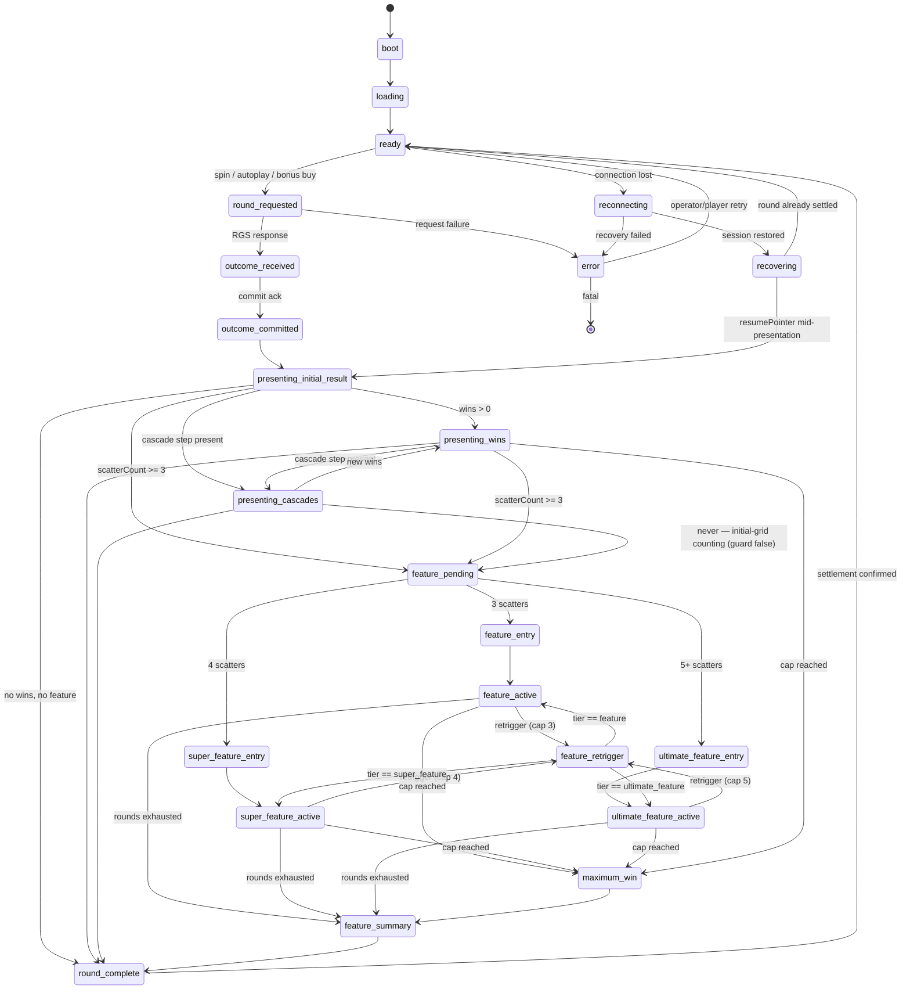
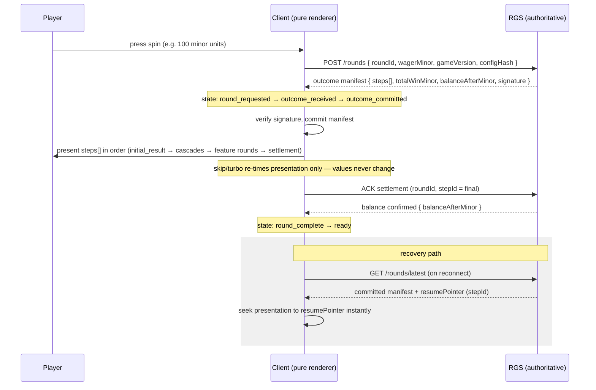

# Game Design Document — Belladonna's Parlour

| Field | Value |
|---|---|
| Game name | Belladonna's Parlour |
| Project slug | belladonna-parlour |
| Game version | 0.1.0 |
| Math version | 0.1.0 |
| Config hash | math `sha256:c3a6de0fadd9f56e9773c190aa69b55834dba77117881750aaa01a2fbb731441` · display `sha256:8f38ce34a29052bf03359e0283accbd892b91c157b2affcf95dd185dab0c4956` |
| Date | 2026-08-08 |
| Generator | single-modern-slot-creator v1.0.0 |

---

## 1. Overview & player fantasy

After midnight, the celebrated perfumer Madame Belladonna unlocks the back room of her Victorian
parlour and takes appointments of a different kind. The player is her trusted client-accomplice:
bottles shatter in cascades across a 6×5 apothecary cabinet, essences distil into the master vial,
and three ever-deeper chambers of her house — the Tasting, the Distillery, the Night Garden —
open at 3, 4 and 5 seals. The emotional arc of a session is *brew → shatter → distil → transgress*:
frequent small chain-reactions in the base game, punctuated by rare, theatrical descents into the
house's secrets where the master vial's multiplier keeps climbing.

Target audience: mainstream slot players with streamer-clip appeal (published 10,000x cap and cap
odds; spectacular tier entries). Market positioning: the proven scatter-pays/tumble package in an
unoccupied theme niche (see docs/research-addendum.md).

**One-line pitch:** A poison-noir apothecary where cascading bottle-breaks distil into an
ever-growing multiplier across three forbidden chambers.

**Player fantasy:** Being the poisoner's favourite client — welcomed past the shopfront into
rooms nobody else sees.

### Concept selection (step 3, G3)

**Candidate A — Belladonna's Parlour** (dark apothecary · 6×5 `scatter_pays` + `cascades`, C1;
supporting `summed_orb_multiplier`, `multiplier_doubler`). Tiers: parlour tasting → cellar
distillery → forbidden night garden. Fantasy: the poisoner's accomplice. Distinct: open
theme×archetype pairing; diegetic multiplier (distillation, not thrown orbs).

**Candidate B — The Gilded Lift** (neon-noir Jazz-Age heist · 5×3 lines + hold-and-respin, C2;
cash loot symbols + 4 fixed jackpots). Tiers: lobby safe → vault floor → the penthouse strongroom.
Fantasy: the cat burglar. Distinct: art-deco gold-on-black; exact-math package.

**Candidate C — Mycelium Crown** (bioluminal fungal court · 7×7 cluster + cascades + collection
meter → mega-wild, C3). Tiers: spore bloom → root throne → the crowning. Fantasy: fungal royalty.
Distinct: genuinely fresh theme; growth = cluster fantasy.

| Criterion (weight) | A | B | C | Justifications (one line per cell, A/B/C) |
|---|---|---|---|---|
| Theme originality (15) | 4 | 4 | 5 | A: potion theme exists but pairing open · B: heist fresh angle, busy cluster · C: no incumbent at all |
| Mechanic coherence (20) | 5 | 4 | 5 | A: shatter+distil+descend = one fantasy · B: lines base disconnected from vault bonus · C: growth=cluster perfect |
| Math feasibility (15) | 5 | 5 | 5 | A: proven C1, Overall 4 · B: C2 exact Markov, Overall 3 · C: C3 proven, Overall 4 |
| Mobile readability (15) | 5 | 5 | 3 | A: 6×5, big silhouette bottles · B: 5×3 trivial · C: 49 cells at 390px is careful-work territory |
| Animation potential (10) | 5 | 4 | 4 | A: shatter/distil/tier-world swaps all clip-worthy · B: vault entry good, base plain · C: bloom pretty, meter abstract |
| Compliance risk, inverted (10) | 4 | 4 | 4 | A: buy/ante gateable, adult framing gate needed (K4) · B: jackpot cert scope · C: meter display/restore duties |
| Production effort, inverted (10) | 3 | 4 | 2 | A: scatter-pays+orb engine extension · B: respin module only · C: cluster+meter+mega-wild all new |
| Market fit (5) | 5 | 4 | 3 | A: top pattern, open gap · B: deployed everywhere · C: adjacent incumbents present |
| **Weighted total (max 500)** | **455** | **430** | **410** | selection: A; margin 25 > 5 ⇒ no tie-break needed |

Rejections: B — weakest theme-mechanic fusion in the busiest niche. C — archetype collides with
both potion incumbents (differentiation req 1) and worst readability/effort.

**Locked identity:** title **Belladonna's Parlour** · backup **The Nightshade Tonic** · tagline
**"Every cure has a price."** · Audio identity: chamber-noir waltz — harpsichord + low strings +
glass harmonica; `music.base` a sparse 3/4 parlour waltz, `music.feature` adds pizzicato pulse,
`music.super_feature` adds low brass + cimbalom drive, `music.ultimate_feature` full nocturne with
choir pads and glass-harmonica lead; beat-quantized transitions. · Core loop: stake → 6×5 drop →
scatter-pays evaluate (8+) → shatter & refill until dry (cap 20) → essence orbs multiply the
sequence → 3/4/5 seals open a chamber where essences BANK into the master vial → settle. ·
Differentiation statement: the only dark-apothecary title on the dominant scatter-pays/tumble
package; multiplier is diegetic distillation with a tier-exclusive prism doubler; three
structurally different chambers instead of one scaled mode.

## 2. Theme & narrative

- **Setting:** A candle-lit Victorian apothecary parlour after midnight; brass fittings, bottle
  cabinets floor-to-ceiling, rain on leaded glass. Madame Belladonna — perfumer to high society,
  poisoner by appointment — never fully seen: gloved hands, a silhouette, a voice.
- **Narrative arc across tiers:** 3 seals — *The Tasting*: she pours in the back parlour and the
  master vial starts collecting. 4 seals — *The Distillery*: down to the copper-lit cellar where
  the house's real work happens; the vial arrives half-charged. 5 seals — *The Night Garden*: the
  moonlit conservatory where belladonna blooms; prisms hang from the glass roof and double what
  the vial holds.
- **Tone / mood:** elegant menace; poison-noir; unhurried, confident, adult.
- **Originality statement:** Original world, characters and names; no franchise references, no
  copied art/characters/sounds; mechanics carry generic internal ids with original themed public
  names; zero hits against the research/16 §3.2 blocklist in game-facing text; adult framing
  throughout — no child characters, no juvenile pastiche, no confectionery cues; trade-dress
  distance from candy-gradient and deity-portrait scatter-pays incumbents is a binding
  requirement on steps 7–9 (docs/research-addendum.md).

## 3. Archetype & grid

| Property | Value |
|---|---|
| Archetype | `scatter_pays` — pays-anywhere threshold grid slot |
| Reels × rows | 6 × 5 |
| Win evaluation | per symbol: count all instances anywhere on the grid; pay bands 8-9 / 10-11 / 12+ of-a-kind, pays on total bet; no lines, no ways, no WILD |
| Grid changes during features | none (6×5 constant; tiers change reel sets, orb economy and multiplier state, never geometry) |
| Cascades | yes — winning symbols shatter, survivors fall, refill from strips; cap: 20 per spin (termination proven by cap + finite strip draws) |

## 4. Symbol set

| Symbol id | Public name | Class | Appears on reels | Substitution rules | Notes |
|---|---|---|---|---|---|
| SCATTER | The Parlour Seal | scatter | all 6 (max 1 visible per reel, strips spaced ≥ window) | never substitutes; blocks nothing | initial-grid counting only; also pays independently (§5) |
| MULT | Essence Orb | multiplier | all 6, base + all tiers | none | lands with a value from the context's orb table (§6.2); collected per tumble sequence |
| FX1 | The Prisming Vial | feature_exclusive | all 6, `ultimate_feature` reel set ONLY | none | doubles the banked multiplier on a winning spin (§6.3) |
| H1 | Belladonna Philtre (amethyst) | premium | all | — | highest premium; hero asset |
| H2 | Serpent's Emerald (venom flask) | premium | all | — | |
| H3 | Widow's Amber (beetle tincture) | premium | all | — | |
| H4 | Moth-Wing Tonic (teal phial) | premium | all | — | |
| L1 | Mandrake Root | low | all | — | |
| L2 | Nightcap Mushrooms | low | all | — | |
| L3 | Black Lotus Pod | low | all | — | |
| L4 | Wax Seal & Twine | low | all | — | |
| L5 | Dried Foxglove Sprig | low | all (base/feature/ante only; removed in super/ultimate sets) | — | added in step-5 tuning (iteration 02) |

No WILD (A6): substitution would duplicate the cascade's win-extension purpose in a pays-anywhere
game. L5 was added during tuning: with composition-derived strip densities, a 9th pay symbol is
required to hold per-symbol counts in the winnable band while keeping hit frequency at 25–30%
(docs/tuning-log.md iteration 02).

## 5. Paytable

Pays are x total bet (stored as payX100 in config/paytable.json; this table must match it exactly
— help-vs-math is a step-13 rejection rule). Band columns replace the of-a-kind columns per
template note for non-line archetypes. **Values below are step-4 design targets; step 5 tuning
owns the final numbers and re-renders this table.**

| Symbol id | 8–9 anywhere (x bet) | 10–11 anywhere (x bet) | 12+ anywhere (x bet) | Notes |
|---|---|---|---|---|
| H1 | 3.20 | 10.00 | 26.00 | |
| H2 | 2.60 | 6.50 | 16.00 | |
| H3 | 2.00 | 4.50 | 10.00 | |
| H4 | 1.30 | 3.20 | 8.00 | |
| L1 | 0.52 | 1.30 | 4.00 | |
| L2 | 0.42 | 1.00 | 3.20 | |
| L3 | 0.34 | 0.80 | 2.60 | |
| L4 | 0.27 | 0.64 | 2.00 | |
| L5 | 0.21 | 0.50 | 1.60 | |
| SCATTER (pays any) | 3 sc: 2 · 4 sc: 6 | 5 sc: 20 | 6 sc: 100 | independent scatter pay: **yes** (on total bet, in addition to tier trigger) |

**FINAL tuned values (tuning iterations 01–08 + battery v3; identical to
math-config/paytable.json and config/paytable.json — help-vs-math rule).** The step-4 draft
values were superseded; docs/tuning-log.md records the path.

## 6. Mechanics

### 6.1 `cascades` — "The Shattering" (primary)

| Field | Value |
|---|---|
| Purpose | Turns every win into a chain-reaction moment; the base game's core dopamine loop — unique in package |
| Trigger | Any scatter-pays win (≥8 of a symbol) on the current grid; probability from reel-strip composition (config/reel-sets.json) |
| States involved | presenting_initial_result → presenting_wins → presenting_cascades (loop) → round_complete \| feature_pending; inside features: feature_active/super_feature_active/ultimate_feature_active render cascade steps within feature_round steps |
| Math impact | sim-only (research/01 §7: cascade chains break closed form); cap 20 cascades/spin; refill from strip continuation above the stop (no replacement table); base-game RTP budget ≈ 0.55–0.60 incl. cascade wins |
| Visual treatment | anim.cascade.remove (shatter), anim.cascade.refill (fall+settle); reducedMotion: cross-fade removal, no shards; lowPerf: no glass particles, sprite swap only |
| Audio treatment | sfx.cascade.shatter (pitch +1 semitone per chain depth, cap +12), sfx.cascade.settle; ducking per audio spec |
| Interruption handling | skip/turbo collapse remove+refill timelines to terminal grid per step; step values untouched (CONVENTIONS §9.2) |
| Recovery behavior | manifest steps are authoritative; resume at resumePointer step, render that step's grid instantly, continue remaining steps |
| Test cases | (1) golden: known grid → exact win set/amounts per band; (2) cap: forced 20-cascade chain terminates with cascade_cap event and no step 21; (3) recovery: kill mid-cascade at step-k, resume shows step-k grid and settles identical total; (4) no-win drop produces zero cascade steps |

### 6.2 `summed_orb_multiplier` — "Distilled Essence" (supporting)

| Field | Value |
|---|---|
| Purpose | Volatility spice + the game's identity fantasy (distillation); converts good sequences into great ones — unique in package |
| Trigger | MULT symbol lands (initial drop or refill); value drawn server-side from the context orb table: base/feature {2..100}, ultimate upgraded {4..100}; weights in config/features.json |
| States involved | same presentation states as cascades; orb collection is per tumble sequence; in features writes the persistent bank P (round state serialized in steps) |
| Math impact | Base game: if sequence win W>0 and orb sum O>0 ⇒ W′ = W×O (single fold, CONVENTIONS §5 money rule). Features: if W>0 ⇒ P += O (then, after any FX1 doubling) W′ = W×P. P0 = 1/2/3 by tier; **P cap ×512**; orbs on losing spins pay/bank nothing (A9 — LDW-safe). RTP budget: the majority of feature-tier contribution (≈ 0.30 of 0.36 total feature RTP) |
| Visual treatment | anim.symbol.land (orb variant with value plate ≥24px), anim.orb.collect (essence streams to master vial), anim.orb.apply (vial pours onto win plate); reducedMotion: fade+counter tick; lowPerf: no fluid shader, straight lerp |
| Audio treatment | sfx.orb.land (glass ping by value band), sfx.orb.collect (liquid draw), sfx.orb.apply (cork pop + swell gated by win tier — never above `small` presentation when total ≤ stake) |
| Interruption handling | collect/apply timelines collapse to final numbers; P and W′ come from the manifest, never recomputed client-side |
| Recovery behavior | P after every feature spin is serialized in each feature_round step (ext.multiplierBank100); resume restores vial display from the step at resumePointer |
| Test cases | (1) W>0,O>0 base: W′==W×O exactly (integer fold); (2) W==0,O>0: no bank, no celebration; (3) feature accumulation: P sequence across spins matches per-step ext values; (4) P cap: forced overflow clamps at 512 with event; (5) odd bet floor exactness vs client money.ts |

### 6.3 `multiplier_doubler` — "The Prisming" (supporting, ultimate-exclusive)

| Field | Value |
|---|---|
| Purpose | Makes the ultimate tier structurally unique (not just bigger numbers): a second-order jump event — unique in package |
| Trigger | FX1 lands during an `ultimate_feature` spin whose sequence win W>0; FX1 exists only on the ultimate reel set; multiple FX1 in one spin still ⇒ one doubling (documented) |
| States involved | ultimate_feature_active only; writes P (P ×= 2 BEFORE the W×P application of that spin); serialized like §6.2 |
| Math impact | ultimate-tier only; P cap ×512 still binds; contributes the ultimate tail (p99/p999 measured per-tier, step 5); frequency tuned so ~1–2 prismings per average ultimate |
| Visual treatment | anim.ultimate_feature.prisming (light refracts through vial, value doubles on the plate); reducedMotion: plate flip; lowPerf: static glow frame |
| Audio treatment | sfx.prisming.chime (glass harmonica gliss), priority high, ducks music −8dB |
| Interruption handling | collapse to final P on the step; nothing recomputed |
| Recovery behavior | same as §6.2 (P serialized per step); prisming event replay is presentation-only |
| Test cases | (1) FX1 on winning spin: P doubles before application, step math exact; (2) FX1 on losing spin: no doubling (documented rule); (3) two FX1 one spin: single doubling; (4) doubling into cap: clamps at 512; (5) FX1 never present outside ultimate reel set (strip audit test) |

### 6.4 Package assessment & rejection rules (step 4, G4)

Ten-dimension assessment (package = research/14 §2 bundle C1; §3 row C1 Overall **4**):

| Dimension | Score | Justification |
|---|---|---|
| Theme fit | 5 | shatter/distil/descend is one fantasy (concept matrix) |
| Mathematical fit | 4 | sim-only but proven bundle; 0.96/10,000x reachable with capped P (research/14 C1) |
| Volatility impact | 4 | 2 extreme levers (persistent P, 12+ bands) — at the D1 ≤2 limit, both capped |
| Mobile readability | 5 | 6×5, ≥44px cells at 390px, orb value text ≥24px, silhouette-distinct bottles |
| UI complexity | 3 | master-vial HUD element + orb plates on symbols; rest standard |
| Animation complexity | 3 | shatter/refill/collect systems; no geometry changes (research/14 C1 Anim 3) |
| State-machine complexity | 3 | no extra states beyond canonical 23; P is round state in steps (C1 SM 3) |
| Simulation complexity | 4 | Overall-4 mandate handled per A10 (dev-grade + documented release plan, risk K3) |
| Performance cost | 3 | glass particles pooled+capped; no shaders on low tier (research/02 D7 budgets) |
| Certification impact | 3 | recovery matrix = base + 3 tiers × (mid-cascade, mid-feature, mid-prisming); tier evidence per-tier sims (C1 Rec 3) |

Rejection rules (prompt.txt step 4) × mechanics — all PASS:

| Rule | cascades | summed_orb_multiplier | multiplier_doubler |
|---|---|---|---|
| Duplicates another's purpose | pass (chain wins) | pass (scales wins) | pass (jumps the bank) |
| Unreadable visual states | pass (removal+refill only) | pass (value plates ≥24px) | pass (single plate event) |
| Excessive feature complexity | pass (one loop, capped) | pass (one number P) | pass (one event type) |
| Max liability unclear | pass (cap 20 + 10,000x term) | pass (P ≤ 512 + term) | pass (P ≤ 512 + term) |
| Unbounded loops | pass (cascade cap 20) | pass (P cap) | pass (one/spin + P cap) |
| Mobile performance | pass (pooled particles) | pass | pass |
| Manifest-representable | pass (cascade steps) | pass (ext.orbs, ext.multiplierBank100 per step) | pass (ext.prisming flag per step) |

### 6.5 Config touch map (build order for step 5+)

| Item | game-config | symbols | paytable | reel-sets | scatter-tiers | features | bonus-buys | state-machine | animation-events | audio-events | spin-presentation |
|---|---|---|---|---|---|---|---|---|---|---|---|
| scatter_pays archetype | grid, evaluation=scatter_pays | pay symbols | bands 8/10/12 | base strips | — | — | — | guards | reel/land events | reel/land sfx | timings |
| cascades | cascade cap | — | — | refill continuation | — | cascade rules | — | presenting_cascades loop | cascade.remove/refill | shatter/settle | cascade pacing |
| summed_orb_multiplier | — | MULT | — | orb placement per set | — | orb tables + P rules per tier | — | — | orb.land/collect/apply | orb pings | value-plate timing |
| multiplier_doubler | — | FX1 | — | ultimate set only | — | doubler rule + P cap | — | — | ultimate.prisming | prisming chime | — |
| tier: feature | — | — | — | feature set | 3 sc row | rounds 8, P0=1 | buy_feature | feature_entry/active | feature.enter | music.feature | — |
| tier: super_feature | — | — | — | super set (premium+orb boost) | 4 sc row | rounds 10, P0=2 | buy_super | super_* states | super_feature.enter | music.super_feature | — |
| tier: ultimate_feature | — | — | — | ultimate set (+FX1, upgraded orbs) | 5 sc row | rounds 12, P0=3, doubler | buy_ultimate | ultimate_* states | ultimate_feature.enter | music.ultimate_feature | — |
| ante mode | anteBet 1.20x (final) | — | — | ante set (scatter ≈×1.55, orbs +) | — | — | (mutually exclusive w/ buys) | — | — | — | — |

## 7. Scatter counting rules

| Rule | Value |
|---|---|
| countingRule | initial-grid |
| Cascaded scatters count | no |
| Copied/transformed scatters count | no (no copy mechanics exist) |
| Scatters pay independently | yes (§5 scatter row, on total bet) |
| Scatters substitute as wilds | no |
| Scatters persist during cascades | yes (never removed by cascades; visible until sequence ends) |
| Reels/positions that may hold scatters | all 6 reels, any row; max 1 visible per reel (strip spacing ≥ window) ⇒ count ∈ 0..6 |
| 3 scatters → tier | `feature` |
| 4 scatters → tier | `super_feature` |
| 5+ scatters → tier | `ultimate_feature` |
| >5 scatters extra award | the 6-scatter independent scatter pay (100x) is the instant award (A8) |
| Retrigger scatter behaviour | 3+ scatters on a feature spin's initial drop ⇒ +5 spins (caps §11); counted initial-drop only |
| Feature-buy trigger generation | buys force entry with scatter counts drawn from the natural conditional distribution (3 for buy_feature, 4 for buy_super, 5–6 for buy_ultimate at natural 5:6 ratio) |
| Anticipation rule | anim.scatter.anticipation fires only while the committed outcome still permits reaching the next tier threshold (2 seals landed, committed count ≥3; 3 landed, committed ≥4; etc.) — never on dead boards |

## 8. Feature Bonus — 3 scatters (`feature`)

**Public name:** The Tasting

| Datapoint | Value |
|---|---|
| Free spins / feature rounds | 10 (final; tuning iterations 04–06) |
| Starting multiplier | master vial P0 = ×1 (empty vial) |
| Active feature modifier(s) | essence banking: winning spins add orb sum to P; wins ×P |
| Feature reel strips / symbol weights | reelSet `feature` (base composition + orb frequency ≈×2.3, E≈1.15/drop, hotter orb table mean ≈5.7) |
| Retrigger rules | 3+ seals on initial drop ⇒ +5 spins |
| Maximum retriggers | 3 |
| Trigger frequency (natural) | **measured 1 in 132** (exact P(3)=7.58×10⁻³) |
| RTP contribution | **measured 0.2887** |
| Average payout (x bet) | **38.1× natural · 40.42× forced-entry (30k)** |
| Median payout (x bet) | **21.3×** |
| Payout percentiles (p99/p99.9) | **235× / 445× (forced)** |
| Maximum payout (x bet) | 10,000 (global cap); max observed 758× |
| Average duration | **10.4 spins** incl. retriggers |
| Entry animation | anim.feature.enter — the parlour curtain draws back; cabinet re-dresses |
| Feature environment | back parlour at candle-light; master vial appears on the counter (HUD) |
| Feature HUD | + master vial (P display), + spins-left counter; balance/bet/win unchanged |
| Feature audio state | music.feature (waltz + pizzicato pulse) |
| Exit summary | feature_summary: total win, final P, retriggers used; "The Tasting concludes" |
| Recovery behavior | resume mid-feature from resumePointer step; vial P and spins-left restored from step ext fields |

## 9. Super Feature Bonus — 4 scatters (`super_feature`)

**Public name:** The Distillery

| Datapoint | Value |
|---|---|
| Free spins / feature rounds | 12 (final) |
| Starting multiplier | P0 = ×3 (vial arrives charged) |
| Active feature modifier(s) | essence banking as §8 PLUS enriched economy (below) |
| Enhancements over `feature` | separate reel set: premium counts +2 each, L5 removed entirely, own orb table (mean ≈7.0); P0 ×3; 12 rounds; retrigger cap 4 — structurally richer distribution, not a re-skin |
| Feature reel strips / symbol weights | reelSet `super_feature` |
| Retrigger rules | 3+ seals ⇒ +5 spins |
| Maximum retriggers | 4 |
| Trigger frequency (natural) | **measured 1 in 2,111** (exact P(4)=4.16×10⁻⁴) |
| RTP contribution | **measured 0.0391** |
| Average payout (x bet) | **82.5× natural · 88.01× forced-entry (30k)** |
| Median payout (x bet) | **50.7×** |
| Payout percentiles (p99/p99.9) | **474× / 874× (forced)** |
| Maximum payout (x bet) | 10,000 (global cap); max observed 1,050× |
| Average duration | **12.7 spins** |
| Entry animation | anim.super_feature.enter — descent down the cellar stair, copper stills ignite |
| Feature environment | cellar distillery: copper, steam, green glass glow |
| Feature HUD | as §8 + distillery pressure dial (pure presentation of P growth rate) |
| Feature audio state | music.super_feature (low brass + cimbalom drive) |
| Exit summary | total win, final P, retriggers; "The Distillery seals its doors" |
| Recovery behavior | as §8 |

**Implementation declaration (required):** the Super Feature uses a **separate reel set**,
**separate symbol weights** (premium ×1.3, L4 removed, orb ×1.6), a **modified feature
configuration** (P0=2, rounds 10, retrigger cap 4) and a **separate bonus-buy entry model**
(buy_super). State machine: shared canonical states with tier-specific guards (no separate
machine — CONVENTIONS §4.4).

## 10. Ultimate Feature Bonus — 5+ scatters (`ultimate_feature`)

**Public name:** The Night Garden

| Datapoint | Value |
|---|---|
| Free spins / feature rounds | 12 |
| Starting multiplier | P0 = ×5 (final; tuning iteration 04) |
| Active feature modifier(s) | essence banking + The Prisming (FX1 doubler, §6.3) |
| Exclusive content | FX1 symbol exists ONLY here (reels 1 & 4); upgraded orb value table (min ×5, mean ≈8.0); exclusive conservatory environment, exclusive nocturne music state, exclusive prisming VFX |
| Natural trigger probability | **exact P(5+) = 1.33×10⁻⁵** |
| Trigger frequency (natural) | **measured 1 in 60,000 (n=50 at 3M; exact 1 in 75,155)** — steeper than the step-4 target band; accepted and documented (tuning-log note 1): marquee-rare with bonus-buy access |
| RTP contribution | **measured 0.0024** |
| Average payout (x bet) | **143.9× natural · 161.01× forced-entry (30k)** |
| Median payout (x bet) | **119.3× natural · 100.4× forced** |
| Tail distribution | **p99 992× · p99.9 2,006× (forced 30k)**; heavy right tail from bank×doubler compounding, hard-capped |
| Maximum payout (x bet) | 10,000 (global cap); max observed 547× natural / 2,006×+ tail forced |
| Maximum exposure | 10,000× × bet, enforced by max_win_termination (unit-proven) |
| Average duration | **12.6 spins** |
| Retrigger behavior | 3+ seals ⇒ +5 spins, cap 5 |
| Maximum-win termination behavior | on cumulative round win = cap: max_win_termination step, remaining spins forfeited, summary shows cap reached |
| Entry animation | anim.ultimate_feature.enter — conservatory doors open to moonlight; prisms descend |
| Feature environment | the Night Garden: glass conservatory, moonlit belladonna in bloom, hanging prisms |
| Feature HUD | as §9 + prism rail showing doubling events |
| Feature audio state | music.ultimate_feature (full nocturne, choir pads, glass harmonica lead) |
| Exit summary | total win, final P, prismings count, retriggers; "The garden closes until next moon" |
| Recovery behavior | as §8; prisming events replayed from steps |
| Bonus-buy price (where permitted) | **buy_ultimate 167.70× (buy RTP 0.9601)** — measured-EV pricing, not the anchor (tuning-log note 3) |
| Separate simulation results | math/reports/tier-ultimate.json (30k forced entries, seed 523) |

## 11. Retriggers

| Tier | Retrigger condition | Award | Cap | Post-cap behaviour |
|---|---|---|---|---|
| feature | 3+ SCATTER on initial drop of a feature spin | +5 spins | 3 | seals still pay scatter pay; no spins added; no retrigger fanfare (LDW-safe: scatter pay itself may still celebrate per its tier) |
| super_feature | same | +5 spins | 4 | same |
| ultimate_feature | same | +5 spins | 5 | same |

## 12. Maximum win

| Property | Value |
|---|---|
| Max win cap (x bet) | 10,000 |
| Cap reachable | mechanically: yes (state P=512 × 12+-band premium exceeds cap; termination unit-proven). Statistically: 0 hits in 3M natural + 90k forced rounds; largest observed 1,050× natural / 2,006× tail — see K7 |
| Per-round probability of cap | **unresolved at dev size — OPEN COMPLIANCE ITEM K7** (tail extrapolation ≪ 1/50M ⇒ advertised-max-win language fails GLI-11 hittability as-is; PAR sheet §8 lists the three resolution paths; rare-event estimation REQUIRED-BEFORE-CERT) |
| Enforcement | math model AND engine (`max_win_termination` step settles exactly at cap) |
| Termination presentation | maximum_win state, anim.maxwin.reached (the master vial overflows — house lights up), non-skippable summary plate |
| Remaining feature rounds on cap | forfeited; feature_summary states it explicitly |

## 13. Bonus buy & enhanced chance

| Buy mode | Tier entered | Price (x bet) | Buy RTP (measured) | Sim report | Jurisdiction gate |
|---|---|---|---|---|---|
| buy_feature | feature | **42.10** | **0.9601** | math/reports/tier-feature.json | bonusBuyEnabled |
| buy_super | super_feature | **91.70** | **0.9598** | math/reports/tier-super.json | bonusBuyEnabled |
| buy_ultimate | ultimate_feature | **167.70** | **0.9601** | math/reports/tier-ultimate.json | bonusBuyEnabled |

Prices derive from measured forced-entry EVs at ~96% buy-RTP parity — deliberately NOT the
100× industry anchor, because this feature is frequent-and-moderate (EV ≈ 40×); anchor pricing
would gut buy RTP (docs/tuning-log.md note 3). Per-mode RTP is disclosed in the buy UI.

**Enhanced chance mode:** "The Patron's Ante" — **stake ×1.20 (final)**, separate ante reel set
with SCATTER frequency ≈×1.55 (measured 1 in 85) and a boosted orb economy; all tiers reachable
naturally; buys disabled while active; mutually exclusive with buys in UI. **Measured effective
RTP 0.9698** (raw 1.1638 ± 0.0227 per 1× stake over 500k rounds, seed 526 —
math/reports/ante-sim.json; +0.47pp vs base, within the ≤+0.5pp enhanced-mode norm; disclosed
in rules), gated by `enhancedChanceEnabled`.

## 14. Spin modes & autoplay

| Mode | Presentation change | Outcome change | Jurisdiction flag |
|---|---|---|---|
| Normal | baseline ≈2.3s spin; full shatter pacing | NONE (renderer of manifest) | — |
| Quick spin | ≈1.2s; drop/settle compressed, cascade pauses halved | NONE | quickSpinEnabled |
| Turbo | ≈0.6s; near-immediate committed grid, cascades fast-forward | NONE | turboSpinEnabled |
| Skip / slam stop | collapse current timeline to its step-terminal state | NONE | animationSkipEnabled |
| Autoplay | finite counts {10,25,50,100}; full stop-condition set | NONE | autoplayEnabled |

**Autoplay stop conditions:** rounds exhausted; any tier trigger (feature/super/ultimate); single-win
≥ configurable threshold; cumulative loss limit reached; cumulative profit limit reached; balance
below threshold; insufficient balance; bet changed; network error; game error; RG interruption /
reality check; max win reached — the full prompts/code-integration.md §7 set.

**Equivalence guarantee:** same outcome manifest ⇒ identical final balance and win in every mode
(gate G12; rejection rule if violated).

## 15. Math summary

**MEASURED** (3M-round dev battery, seed 5252 — docs/par-sheet.md is authoritative; the
step-4 target split was superseded by tuning: the steep natural tier rarity shifts weight
from super/ultimate into feature — tuning-log note 1):

| Win source | RTP contribution | Notes |
|---|---|---|
| Base game | 0.61659 | incl. cascade wins and base orb multipliers |
| `feature` | 0.28866 | 1 in 132, avg 38.1× |
| `super_feature` | 0.03910 | 1 in 2,111, avg 82.5× |
| `ultimate_feature` | 0.00240 | 1 in 60,000 measured, avg 143.9× |
| Scatter pay | 0.01838 | independent seal pays |
| Jackpot (if any) | — | none |
| **Total** | **0.9651 ± 0.0077** | dev gate |0.9651−0.96| = 0.0051 ≤ 0.01 → **PASS** |

| Stat | Value |
|---|---|
| Volatility class / index | **medium-high · σ = 6.81** (measured; step-4 "high→very-high" superseded) |
| Hit frequency | **0.2849** (target band 0.25–0.30 ✓) |
| RTP profiles offered | 0.9600 (this build); 0.94/0.92 declared not-built (A4) |
| Min / max bet (minor units) | 10 / 10000 |

## 16. UI summary

- **Layouts covered:** portrait (priority), landscape, tablet, desktop, ultrawide — full spec in
  step-7 deliverable; portrait puts the cabinet top 62%, vial + HUD bottom band, thumb-zone spin.
- **HUD:** balance · total bet · win · spin state always visible; master vial (P) during features;
  net-position + session clock elements available for policy-gated markets.
- **Key screens/overlays:** paytable (rendered FROM config/paytable.json), rules, settings, buy
  menu (gated), ante toggle (gated), autoplay panel, history/replay — overlays, never machine states.
- **Touch targets:** ≥ 44px; **text contrast:** ≥ 4.5:1 in HUD.

## 17. Motion summary

- **Signature moments:** tier entries (curtain/stair/conservatory), the Prisming, vial overflow at
  max win — the three clip moments; full timings in step-8 deliverable.
- **Anticipation rules:** committed-outcome-gated only (§7 anticipation rule); never on dead boards.
- **Win-tier presentation:** small < 5x, medium ≥ 5x, big ≥ 15x, mega ≥ 40x, epic ≥ 80x, max = cap
  (no overrides).
- **Reduced-motion strategy:** every event ships a reducedMotion variant (cross-fades + counters,
  no shards/shake/parallax); lowPerformance variants drop particles/shaders first.

## 18. Audio summary

- **Adaptive music design:** four horizontal states (base/feature/super/ultimate) sharing the
  waltz motif, beat-quantized transitions, vertical intensity layer driven by P growth.
- **Tier differentiation:** §1 audio identity — each tier adds instrumentation; ultimate is an
  exclusive nocturne, not a louder base loop.
- **Silent-safe behaviour:** client runs fully with missing audio files.

## 19. State machine

## 20. Round sequence (client ↔ RGS)

## 21. Jurisdiction gating

| Flag | Default policy (mt-generic) | Restricted-policy behaviour (restricted-default / gb / de) |
|---|---|---|
| autoplayEnabled | true | false (gb, de, restricted-default) |
| quickSpinEnabled | true | false (gb, restricted-default) |
| turboSpinEnabled | true | false (gb, de, restricted-default) |
| animationSkipEnabled | true | false (gb, restricted-default) |
| bonusBuyEnabled | true | false (gb, nl, restricted-default) |
| enhancedChanceEnabled | true | false (restricted-default; per-market review) |
| minimumRoundDurationMs | null | 2500 (gb/on), 3000 (se/es), 5000 (de, restricted-default) |
| showRtp | true | true (mandatory gb/mt/se) |
| showMaximumWin | true | true |
| showGameHistory | true | true |

LDW suppression (win ≤ stake never celebrated above `small`) is unconditional in all policies
(CONVENTIONS §9.5), not a flag.

## 22. Accessibility

- Reduced-motion variant exists for every animation event: yes — enforced by G8 field checks.
- No information conveyed by colour alone: symbol silhouettes distinct; orb values printed; tier
  states named in HUD text.
- Touch targets ≥ 44px: yes (layout rule, step 7).
- Flash rate ≤ 3/s everywhere: yes — shatter/prisming effects budgeted; zero saturated-red flashes.
- HUD text contrast ≥ 4.5:1: yes (palette locked in style bible, step 9).
- Screen-reader / focus considerations: hidden sub-DOM mirroring HUD values + round results;
  spin/stop/bet controls keyboard-operable; focus order documented in step-7 spec.

## 23. Assumptions

Mirror of docs/assumption-log.md — see A1–A11 there; load-bearing for this design: A6 (no WILD),
A7 (initial-grid counting), A8 (≤6 scatters), A9 (orbs bank on wins only), A10 (dev-grade sims
this run), A11 (caps: P ≤ 512, cascades ≤ 20, retriggers 3/4/5).

## 24. Open risks

Mirror of docs/risk-register.md K1–K6 (all open at GDD sign-off; owners and mitigations there).

---

> This document describes a certification-ready **candidate**. It is not
> certified. Real-money release requires jurisdiction-specific legal review,
> independent mathematical verification, external security review, laboratory
> certification where applicable, and operator/aggregator acceptance testing.
