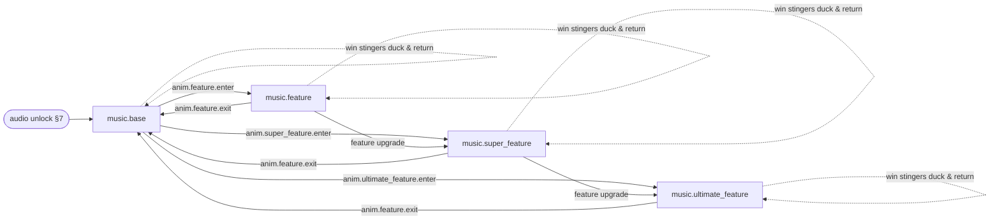

<!--
TEMPLATE: audio-specification.md — single-modern-slot-creator v1.0.0
Fill every {{placeholder}}. Delete no sections; if a section does not apply,
write "Not applicable — <reason>" and log it in docs/assumption-log.md.
Numeric values in the tables are RECOMMENDED DEFAULTS — tune per design, then
mirror every row 1:1 into config/audio-events.json (must validate against
schemas/audio-event.schema.json — gate G10). Event ids are FIXED per
CONVENTIONS §4.3 (music.<state>, sfx.<context>.<name>, amb.<name>, ui.<name>).
Every animation event's audioEvent (motion-specification.md §3) must exist
here. Music states must cover base + all three tiers. The client's audio
manager is silent-safe: the game runs correctly with every audio file missing
(CONVENTIONS §8). Adaptive audio must never imply that player input can affect
an already committed outcome.
-->

# Audio Specification — {{gameName}}

| Field | Value |
|---|---|
| Game name | {{gameName}} |
| Project slug | {{projectSlug}} |
| Game version | {{gameVersion}} |
| Math version | {{mathVersion}} |
| Config hash | {{configHash}} <!-- sha256:<64 hex> per CONVENTIONS §5 --> |
| Date | {{dateIso}} |
| Generator | single-modern-slot-creator v1.0.0 |

---

## 1. Audio direction

- **Sonic identity (one sentence):** {{sonicIdentity}}
- **Instrumentation / sound palette:** {{instrumentation}} <!-- e.g. "bowed glass, sub pulses, wet percussion; no orchestral brass" -->
- **Tempo & key plan:** base {{baseBpm}} BPM in {{baseKey}}; tiers escalate: feature {{featureBpm}} BPM, super_feature {{superBpm}} BPM, ultimate_feature {{ultimateBpm}} BPM — all harmonically compatible for crossfades ({{keyRelationship}}).
- **Intensity layering:** music states ship {{intensityLayerCount}} stem layers (e.g. bed / pulse / lead) mixed by game context (win streaks, anticipation) — layering is presentation only and reflects the committed outcome, never predicts it.

## 2. Music-state graph

<!-- Keep node names = eventIds. Win stingers are one-shots that duck the
active music state and return to it; they are not states. Extend only with
design-specific states (e.g. jackpot). -->

- **Transition rule:** music-state changes crossfade over {{musicCrossfadeMs}} ms ({{1200}} ms recommended), aligned to the next {{crossfadeQuantize}} <!-- bar / half-bar / immediate --> of the outgoing track.
- **Anticipation layer:** `sfx.scatter.tension_2` rides ON TOP of the current music state (it is not a state change) and resolves into either a trigger stinger or a short release fall.

## 3. Bus structure & mixing rules

### 3.1 Buses

| Bus | Contents | Default gain | Notes |
|---|---|---|---|
| `master` | all | 0 dB | true peak ceiling −1 dBTP |
| `music` | `music.*` | {{-14}} dB | ducked per §3.3 |
| `sfx` | `sfx.*` | {{-8}} dB | outcome & feedback sounds |
| `ui` | `ui.*` | {{-12}} dB | button/interaction sounds |
| `amb` | `amb.*` | {{-18}} dB | beds & room tone |

### 3.2 Loudness targets

| Content | Target |
|---|---|
| Full mix, typical play (integrated) | {{-16}} LUFS (mobile speaker check at {{-14}} LUFS) |
| Music stems (delivered files, integrated) | {{-16}} LUFS |
| Ambience beds | {{-22}} LUFS |
| Short SFX / stingers (short-term max) | {{-12}} LUFS |
| True peak, every delivered file | ≤ −1.0 dBTP |
| Max celebration loudness (epic/max win, short-term) | {{-10}} LUFS — never louder; escalate by texture, not level |

### 3.3 Ducking matrix

<!-- Attack/release in ms. Ducking is sidechain gain on the TARGET bus while
the trigger plays. -->

| Trigger | Target bus | Amount | Attack | Release |
|---|---|---|---|---|
| Win stingers (small/medium) | `music` | −{{3}} dB | {{20}} | {{400}} |
| Win stingers (big/mega/epic/max) | `music` + `amb` | −{{8}} dB | {{20}} | {{800}} |
| Tier trigger/entry stingers | `music` + `amb` + `sfx` | −{{8}} dB | {{10}} | {{600}} |
| `sfx.scatter.tension_2` | `music` | −{{6}} dB | {{200}} | {{600}} |
| Error / system sounds | everything else | −{{6}} dB | {{10}} | {{300}} |
| Voice/VO (if any: {{voYesNo}}) | `music` + `amb` | −{{6}} dB | {{20}} | {{400}} |

## 4. Audio-event inventory

<!-- One row per event required by the mission brief. Columns:
loop — yes/no (loop points per §6); priority — 0–100, higher wins a voice;
polyphony — max simultaneous instances (excess: see interrupt);
volumeDb — event gain relative to its bus; ducking — what this event ducks
(details §3.3); interrupt — steal-oldest / ignore-if-playing / crossfade /
exclusive (stops the whole bus band) / retrigger-ok; mobileFallback — behavior
on low-end devices; focusLoss — pause / stop / continue (§8); reducedSensory —
behavior in reduced-sensory mode (§9); animEvent — triggering animation event
(motion-specification.md §3); promptRef — id in prompts/audio-prompts.json
(the prompt entry carries format, sample rate, bit rate, duration, loop
points, LUFS and the generation prompt per §5–§6).
Files live in assets/audio/. -->

| Event | eventId | file | loop | priority | polyphony | volumeDb | ducking | interrupt | mobileFallback | focusLoss | reducedSensory | animEvent | promptRef |
|---|---|---|---|---|---|---|---|---|---|---|---|---|---|
| Game boot | `sfx.system.boot` | `sfx-system-boot.ogg` | no | 40 | 1 | {{-12}} | — | ignore-if-playing | same | stop | −6 dB | `anim.system.boot` | `sfx.system.boot` |
| Loading completion | `sfx.system.loading_complete` | `sfx-system-loading-complete.ogg` | no | 40 | 1 | {{-10}} | — | ignore-if-playing | same | stop | −6 dB | `anim.system.loading_complete` | `sfx.system.loading_complete` |
| Base-game ambience | `amb.base` | `amb-base.ogg` | yes | 20 | 1 | {{-6}} | — | crossfade {{800}} ms | skip on low-end | pause | skip | `anim.system.idle` | `amb.base` |
| Base-game music | `music.base` | `music-base.ogg` | yes | 30 | 1 | {{0}} | — | crossfade §2 | lower-bitrate variant | pause | −6 dB | — | `music.base` |
| Spin start | `sfx.reel.spin_start` | `sfx-reel-spin-start.ogg` | no | 50 | 2 | {{-4}} | — | retrigger-ok | same | stop | −6 dB | `anim.reel.spin_start` | `sfx.reel.spin_start` |
| Reel movement | `sfx.reel.loop` | `sfx-reel-loop.ogg` | yes | 35 | 1 | {{-8}} | — | stops at decelerate | skip | stop | skip | `anim.reel.spin_loop` | `sfx.reel.loop` |
| Reel stops | `sfx.reel.stop` | `sfx-reel-stop.ogg` | no | 55 | 5 | {{-4}} | — | retrigger-ok | same | stop | −6 dB | `anim.reel.stop` | `sfx.reel.stop` |
| Quick-spin reel stops | `sfx.reel.quick_stop` | `sfx-reel-quick-stop.ogg` | no | 55 | 5 | {{-4}} | — | retrigger-ok | same | stop | −6 dB | `anim.reel.quick_stop` | `sfx.reel.quick_stop` |
| Turbo-spin result | `sfx.reel.turbo_result` | `sfx-reel-turbo-result.ogg` | no | 55 | 1 | {{-4}} | — | ignore-if-playing | same | stop | −6 dB | `anim.reel.turbo_result` | `sfx.reel.turbo_result` |
| Wild landing | `sfx.wild.land` | `sfx-wild-land.ogg` | no | 60 | 3 | {{-3}} | music −2 dB | retrigger-ok | same | stop | −6 dB | `anim.wild.land` | `sfx.wild.land` |
| Scatter landing | `sfx.scatter.land` | `sfx-scatter-land.ogg` | no | 70 | 3 | {{-2}} | music −3 dB | retrigger-ok (pitch-step per scatter) | same | stop | −6 dB | `anim.scatter.land` | `sfx.scatter.land` |
| Second-scatter tension | `sfx.scatter.tension_2` | `sfx-scatter-tension.ogg` | yes (until resolve) | 75 | 1 | {{-4}} | music −6 dB | exclusive within `sfx.scatter.*` | shortened one-shot | stop | −6 dB, half length | `anim.scatter.anticipation` | `sfx.scatter.tension_2` |
| Third-scatter Feature trigger | `sfx.feature.trigger` | `sfx-feature-trigger.ogg` | no | 85 | 1 | {{-2}} | all −8 dB | exclusive | same | stop | −6 dB | `anim.feature.trigger` | `sfx.feature.trigger` |
| Fourth-scatter Super Feature trigger | `sfx.super_feature.trigger` | `sfx-super-feature-trigger.ogg` | no | 90 | 1 | {{-2}} | all −8 dB | exclusive | same | stop | −6 dB | `anim.super_feature.trigger` | `sfx.super_feature.trigger` |
| Fifth-scatter Ultimate Feature trigger | `sfx.ultimate_feature.trigger` | `sfx-ultimate-feature-trigger.ogg` | no | 95 | 1 | {{-2}} | all −8 dB | exclusive | same | stop | −6 dB | `anim.ultimate_feature.trigger` | `sfx.ultimate_feature.trigger` |
| Cascade | `sfx.cascade.remove` | `sfx-cascade-remove.ogg` | no | 50 | 4 | {{-5}} | — | retrigger-ok (+1 semitone per chain step, cap +12) | same | stop | −6 dB, no pitch-step | `anim.cascade.remove` | `sfx.cascade.remove` |
| Grid refill | `sfx.cascade.refill` | `sfx-cascade-refill.ogg` | no | 45 | 2 | {{-6}} | — | retrigger-ok | same | stop | −6 dB | `anim.cascade.refill` | `sfx.cascade.refill` |
| Grid expansion | `sfx.grid.expand` | `sfx-grid-expand.ogg` | no | 60 | 1 | {{-3}} | music −3 dB | ignore-if-playing | same | stop | −6 dB | `anim.grid.expand` | `sfx.grid.expand` |
| Multiplier increase | `sfx.mult.increase` | `sfx-mult-increase.ogg` | no | 60 | 2 | {{-3}} | — | retrigger-ok (pitch-step per level) | same | stop | −6 dB | `anim.mult.increase` | `sfx.mult.increase` |
| Meter collection | `sfx.meter.collect` | `sfx-meter-collect.ogg` | no | 50 | 4 | {{-5}} | — | retrigger-ok | same | stop | −6 dB | `anim.meter.collect` | `sfx.meter.collect` |
| Standard win | `sfx.win.small` | `sfx-win-small.ogg` | no | 55 | 1 | {{-4}} | music −3 dB | crossfade | same | stop | −6 dB | `anim.win.countup` | `sfx.win.small` |
| Medium win | `sfx.win.medium` | `sfx-win-medium.ogg` | no | 60 | 1 | {{-3}} | music −3 dB | crossfade | same | stop | −6 dB | `anim.win.countup` | `sfx.win.medium` |
| Big Win | `sfx.win.big` | `sfx-win-big.ogg` | no | 80 | 1 | {{-2}} | music+amb −8 dB | exclusive within `sfx.win.*` | same | stop | −6 dB, half length | `anim.win.big` | `sfx.win.big` |
| Mega Win | `sfx.win.mega` | `sfx-win-mega.ogg` | no | 85 | 1 | {{-2}} | music+amb −8 dB | exclusive within `sfx.win.*` | same | stop | −6 dB, half length | `anim.win.mega` | `sfx.win.mega` |
| Epic Win | `sfx.win.epic` | `sfx-win-epic.ogg` | no | 90 | 1 | {{-1}} | music+amb −8 dB | exclusive within `sfx.win.*` | same | stop | −6 dB, half length | `anim.win.epic` | `sfx.win.epic` |
| Maximum Win | `sfx.win.max` | `sfx-win-max.ogg` | no | 100 | 1 | {{-1}} | everything −8 dB | exclusive | same | stop | −6 dB, half length | `anim.maxwin.reached` | `sfx.win.max` |
| Feature Bonus entry | `sfx.feature.enter` | `sfx-feature-enter.ogg` | no | 85 | 1 | {{-2}} | all −8 dB | exclusive | same | stop | −6 dB | `anim.feature.enter` | `sfx.feature.enter` |
| Feature Bonus music | `music.feature` | `music-feature.ogg` | yes | 30 | 1 | {{0}} | — | crossfade §2 | lower-bitrate variant | pause | −6 dB | — | `music.feature` |
| Super Feature entry | `sfx.super_feature.enter` | `sfx-super-feature-enter.ogg` | no | 90 | 1 | {{-2}} | all −8 dB | exclusive | same | stop | −6 dB | `anim.super_feature.enter` | `sfx.super_feature.enter` |
| Super Feature music | `music.super_feature` | `music-super-feature.ogg` | yes | 30 | 1 | {{0}} | — | crossfade §2 | lower-bitrate variant | pause | −6 dB | — | `music.super_feature` |
| Ultimate Feature entry | `sfx.ultimate_feature.enter` | `sfx-ultimate-feature-enter.ogg` | no | 95 | 1 | {{-2}} | all −8 dB | exclusive | same | stop | −6 dB | `anim.ultimate_feature.enter` | `sfx.ultimate_feature.enter` |
| Ultimate Feature music | `music.ultimate_feature` | `music-ultimate-feature.ogg` | yes | 30 | 1 | {{0}} | — | crossfade §2 | lower-bitrate variant | pause | −6 dB | — | `music.ultimate_feature` |
| Retrigger | `sfx.feature.retrigger` | `sfx-feature-retrigger.ogg` | no | 75 | 1 | {{-3}} | music −6 dB | exclusive | same | stop | −6 dB | `anim.feature.retrigger` | `sfx.feature.retrigger` |
| Feature summary | `sfx.feature.summary` | `sfx-feature-summary.ogg` | no | 80 | 1 | {{-3}} | music −6 dB | exclusive | same | stop | −6 dB | `anim.feature.summary` | `sfx.feature.summary` |
| Return to base game | `sfx.feature.exit` | `sfx-feature-exit.ogg` | no | 70 | 1 | {{-4}} | — | crossfade | same | stop | −6 dB | `anim.feature.exit` | `sfx.feature.exit` |
| Autoplay start | `ui.autoplay_start` | `ui-autoplay-start.ogg` | no | 45 | 1 | {{0}} | — | ignore-if-playing | same | stop | −6 dB | `anim.autoplay.start` | `ui.autoplay_start` |
| Autoplay stop | `ui.autoplay_stop` | `ui-autoplay-stop.ogg` | no | 45 | 1 | {{0}} | — | ignore-if-playing | same | stop | −6 dB | `anim.autoplay.stop` | `ui.autoplay_stop` |
| Button interactions | `ui.button_press` | `ui-button-press.ogg` | no | 40 | 2 | {{-2}} | — | retrigger-ok | same | stop | −6 dB | `anim.ui.spin_pressed` (+ all controls) | `ui.button_press` |
| Error | `sfx.system.error` | `sfx-system-error.ogg` | no | 90 | 1 | {{-4}} | all −6 dB | exclusive | same | continue | same (information, never softened away) | `anim.system.error` | `sfx.system.error` |
| Reconnection | `sfx.system.reconnect` | `sfx-system-reconnect.ogg` | no | 60 | 1 | {{-6}} | — | ignore-if-playing | same | continue | −6 dB | `anim.system.reconnect` | `sfx.system.reconnect` |
| Recovered round | `sfx.system.recover` | `sfx-system-recover.ogg` | no | 60 | 1 | {{-6}} | — | ignore-if-playing | same | continue | −6 dB | `anim.system.recover` | `sfx.system.recover` |

### 4.1 Mechanic-conditional events

<!-- Add these rows to the main table (and to config/audio-events.json) ONLY
if the design uses the mechanic; otherwise delete and log in
docs/assumption-log.md. Every audioEvent referenced by
motion-specification.md §3 must resolve. -->

| Event | eventId | animEvent | Include when |
|---|---|---|---|
| Mystery-symbol reveal | `sfx.mystery.reveal` | `anim.mystery.reveal` | MYSTERY symbol in design |
| Respin start | `sfx.respin.start` | `anim.respin.start` | respin mechanic |
| Sticky-symbol lock | `sfx.symbol.sticky_lock` | `anim.symbol.sticky_lock` | sticky/hold mechanic |
| Feature upgrade | `sfx.feature.upgrade` | `anim.feature.upgrade` | tier-upgrade mechanic |
| Win countup ticker (loop) | `sfx.win.countup_loop` | `anim.win.countup` | if countup uses a ticking loop under the stinger |
| Jackpot award | `sfx.jackpot.award` | `anim.jackpot.award` | JP_* symbols in design |

## 5. File format defaults

<!-- Per-file technical fields (format, sample rate, bit rate, duration, loop
points, LUFS, generation prompt) are carried per event in
prompts/audio-prompts.json (promptRef column). These are the package-wide
defaults those entries inherit. -->

| Property | Default |
|---|---|
| Delivery format | OGG Vorbis (`.ogg`) primary; `.m4a` (AAC) fallback for Safari where needed |
| Sample rate | {{48000}} Hz (never mixed rates within the package) |
| Bit rate | music/amb {{160}} kbps VBR; sfx/ui {{128}} kbps VBR; mobile-fallback music {{96}} kbps mono where flagged |
| Channels | music/amb stereo; sfx/ui mono unless spatial ({{spatialSfxList}}) |
| Max file sizes | music ≤ {{2}} MB, sfx ≤ {{200}} KB, total audio budget ≤ {{audioBudgetMb}} MB |
| Silence padding | none — trims to first/last sample above −60 dBFS (loops per §6) |

## 6. Loop-point specification rules

1. Every `loop: yes` file declares `loopStartSample` and `loopEndSample` — **sample-accurate** integers at the package sample rate ({{48000}} Hz), recorded in prompts/audio-prompts.json and config/audio-events.json.
2. Music loops are **whole bars**: loop length = `barsInLoop × (60 / BPM) × beatsPerBar × sampleRate` samples exactly. Record BPM ({{baseBpm}} etc. per §1), time signature ({{timeSignature}}), and `barsInLoop` ({{barsInLoop}} recommended: 8–16 for music, 4 for ambience) per file.
3. Zero-crossing rule: loop points sit on zero crossings or the file ships a {{5}} ms equal-power crossfade region; no clicks at the seam at +12 dB monitoring.
4. Reverb/decay tails must be baked INSIDE the loop (pre-rolled), not cut at the seam — generate loops as ≥ 2 consecutive passes and cut the middle.
5. Intro-then-loop is allowed: `loopStartSample > 0` plays the intro once, then cycles [loopStart, loopEnd).
6. The audio manager loops via WebAudio `AudioBufferSourceNode.loopStart/loopEnd` (seconds = samples / sampleRate) — never via `ended`-event rescheduling (drifts).
7. Verification: each loop plays ≥ {{10}} consecutive cycles in the test harness with no audible click/drift; result logged in docs/validation-report.md.

## 7. Audio-unlock gesture handling

1. Browsers block audio until a user gesture: the audio manager starts in `locked` state, and the game NEVER blocks gameplay, loading, or settlement on audio (silent-safe, CONVENTIONS §8).
2. On the first `pointerdown`/`keydown` anywhere (including the loading screen's "tap to continue"): resume the `AudioContext`, play a {{1}}-sample silent buffer to unlock iOS, then start `music.base` + `amb.base` with a {{400}} ms fade-in.
3. Events fired while locked are NOT queued for later playback (stale audio is worse than silence) — except the current music state, which starts at unlock.
4. If the context resumes in a suspended state again (iOS route change, bluetooth swap), re-arm the unlock listener and continue silently.
5. Mute/volume settings persist ({{persistenceMechanism}}); a muted session still runs the full event pipeline at gain 0 so timing bugs surface in QA.

## 8. Focus loss & backgrounding

- `visibilitychange → hidden`: per-event `focusLoss` column — `pause` (music/amb resume where they left off), `stop` (one-shots are discarded), `continue` (system/error sounds only, at reduced gain, where the platform allows).
- Suspend the `AudioContext` after {{contextSuspendDelayMs}} ms hidden to save battery; resume on visibility + (if required) a fresh gesture per §7.
- After resume, the music state is re-derived from the CURRENT game state (never replayed history), aligned with motion-specification.md §8 recovery.

## 9. Reduced-sensory mode

When the player enables reduced-sensory mode (paired with reduced-motion, art-style-bible.md §16):

1. Per-event `reducedSensory` column applies: most events −{{6}} dB; celebration stingers also halve in length; purely decorative loops (`sfx.reel.loop`, ambience) are skipped.
2. Dynamic-range compression on `master` eases to gentle ({{reducedSensoryCompressor}}), no sidechain pumping: ducking amounts halve.
3. Error/system sounds keep full clarity — accessibility information is never softened away.
4. No rapid stutter/tremolo effects; anticipation tension uses a smooth pad instead of pulses.

## 10. Config & prompt synchronisation

- Every row in §4 (plus included §4.1 rows) maps 1:1 to `config/audio-events.json` (schema: `schemas/audio-event.schema.json`) carrying the full field set: eventId, fileName, format, sampleRate, bitRate, durationMs, loopStartSample/loopEndSample, priority, polyphony, volumeDb, loudnessTarget, ducking, interrupt, mobileFallback, focusLoss, reducedSensory, animEvent.
- Every `promptRef` resolves to an entry in `prompts/audio-prompts.json` including its generation prompt (works with ElevenLabs-SFX / Stable-Audio-class tools), technical fields per §5–§6, and provenance.
- Gate G10 fails if: any config file is schema-invalid, any animation event's `audioEvent` is missing here, or music states do not cover base + all three tiers. Order of truth: config > this document; fix config first, then re-sync the doc.
