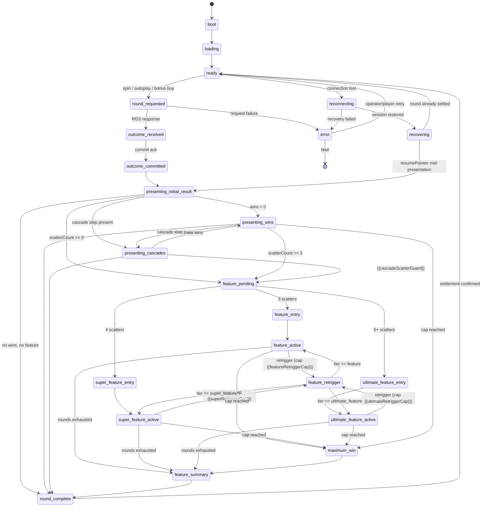
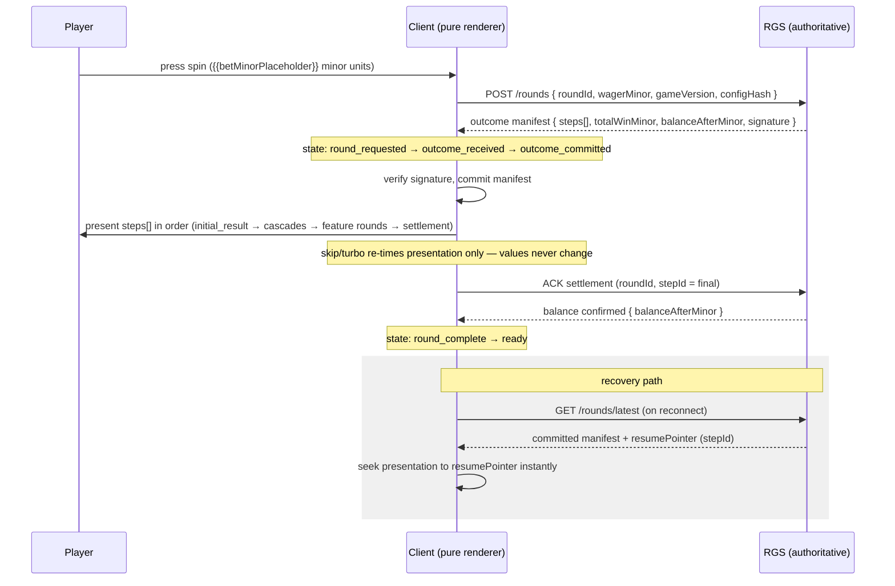

<!--
TEMPLATE: game-design-document.md — single-modern-slot-creator v1.0.0
Fill every {{placeholder}}. Delete no sections; if a section does not apply,
write "Not applicable — <reason>" and log it in docs/assumption-log.md.
All money values in integer minor units (fields suffixed Minor); pays as x-bet
with <= 2 decimals stored as payX100 integers in configs. Tier internal ids are
ALWAYS feature / super_feature / ultimate_feature (CONVENTIONS §4.1) even when
the public names are themed. Keep tables complete — add rows, never remove
header rows.
-->

# Game Design Document — {{gameName}}

| Field | Value |
|---|---|
| Game name | {{gameName}} |
| Project slug | {{projectSlug}} |
| Game version | {{gameVersion}} |
| Math version | {{mathVersion}} |
| Config hash | {{configHash}} <!-- sha256:<64 hex> per CONVENTIONS §5 --> |
| Date | {{dateIso}} |
| Generator | single-modern-slot-creator v1.0.0 |

---

## 1. Overview & player fantasy

<!-- 2–4 paragraphs: elevator pitch, the core player fantasy, the emotional arc
of a session, and the single sentence that sells the game. State the target
audience and market positioning (see research dossier + docs/source-register.md). -->

{{overviewText}}

**One-line pitch:** {{oneLinePitch}}

**Player fantasy:** {{playerFantasy}}

## 2. Theme & narrative

<!-- Describe the world, setting, characters, and how the three bonus tiers map
to an escalating narrative. Confirm originality: no copied names, characters,
art, or trademarked mechanic names (CONVENTIONS §9.10, research/16-ip-risk-register.md). -->

- **Setting:** {{themeSetting}}
- **Narrative arc across tiers:** {{narrativeArc}}
- **Tone / mood:** {{toneMood}}
- **Originality statement:** {{originalityStatement}}

## 3. Archetype & grid

| Property | Value |
|---|---|
| Archetype | {{archetype}} <!-- e.g. lines, ways, cluster, hold-and-respin --> |
| Reels × rows | {{reels}} × {{rows}} |
| Win evaluation | {{winEvaluation}} <!-- e.g. 20 fixed lines / ways / cluster rules --> |
| Grid changes during features | {{gridChanges}} |
| Cascades | {{cascadesYesNo}} — cap: {{cascadeCap}} <!-- must prove termination --> |

## 4. Symbol set

<!-- One row per symbol. Ids follow CONVENTIONS §4.2 (WILD, SCATTER, H1..H4,
L1..L5, FX1.., MULT, CASH, COLLECT, MYSTERY, JP_*, BLANK). H1 is the highest premium. -->

| Symbol id | Public name | Class | Appears on reels | Substitution rules | Notes |
|---|---|---|---|---|---|
| WILD | {{wildName}} | wild | {{wildReels}} | {{wildSubstitution}} | {{wildNotes}} |
| SCATTER | {{scatterName}} | scatter | {{scatterReels}} | {{scatterSubstitution}} | {{scatterNotes}} |
| H1 | {{h1Name}} | premium | {{h1Reels}} | — | highest premium |
| H2 | {{h2Name}} | premium | {{h2Reels}} | — | {{h2Notes}} |
| H3 | {{h3Name}} | premium | {{h3Reels}} | — | {{h3Notes}} |
| H4 | {{h4Name}} | premium | {{h4Reels}} | — | {{h4Notes}} |
| L1 | {{l1Name}} | low | {{l1Reels}} | — | {{l1Notes}} |
| L2 | {{l2Name}} | low | {{l2Reels}} | — | {{l2Notes}} |
| L3 | {{l3Name}} | low | {{l3Reels}} | — | {{l3Notes}} |
| L4 | {{l4Name}} | low | {{l4Reels}} | — | {{l4Notes}} |
| L5 | {{l5Name}} | low | {{l5Reels}} | — | {{l5Notes}} |

<!-- Add feature-exclusive (FX1..), MULT, CASH, COLLECT, MYSTERY, JP_*, BLANK
rows here if the design uses them; delete unused low symbols only if the
paytable and reel strips agree. -->

## 5. Paytable

<!-- Pays are x-bet with <= 2 decimals; stored in config/paytable.json as
payX100 integers (2.5x -> 250). This table is the human-readable rendering and
MUST match config/paytable.json exactly (help-vs-math consistency is a
rejection rule). -->

| Symbol id | 3-of-a-kind (x bet) | 4-of-a-kind (x bet) | 5-of-a-kind (x bet) | Notes |
|---|---|---|---|---|
| H1 | {{h1Pay3}} | {{h1Pay4}} | {{h1Pay5}} | |
| H2 | {{h2Pay3}} | {{h2Pay4}} | {{h2Pay5}} | |
| H3 | {{h3Pay3}} | {{h3Pay4}} | {{h3Pay5}} | |
| H4 | {{h4Pay3}} | {{h4Pay4}} | {{h4Pay5}} | |
| L1 | {{l1Pay3}} | {{l1Pay4}} | {{l1Pay5}} | |
| L2 | {{l2Pay3}} | {{l2Pay4}} | {{l2Pay5}} | |
| L3 | {{l3Pay3}} | {{l3Pay4}} | {{l3Pay5}} | |
| L4 | {{l4Pay3}} | {{l4Pay4}} | {{l4Pay5}} | |
| L5 | {{l5Pay3}} | {{l5Pay4}} | {{l5Pay5}} | |
| SCATTER (pays any) | {{scatterPay3}} | {{scatterPay4}} | {{scatterPay5}} | independent scatter pay: {{scatterPaysIndependently}} |

<!-- Adapt columns for ways/cluster archetypes (e.g. cluster-size bands). Keep
the header row. -->

## 6. Mechanics

<!-- One subsection per mechanic: the primary mechanic first, then <= 3
supporting mechanics (gate G4). Fill EVERY field for EVERY mechanic. -->

### 6.{{n}} {{mechanicName}}

| Field | Value |
|---|---|
| Purpose | {{mechanicPurpose}} <!-- what player problem/emotion it serves --> |
| Trigger | {{mechanicTrigger}} <!-- exact condition, probability source --> |
| States involved | {{mechanicStates}} <!-- only canonical states, CONVENTIONS §4.4 --> |
| Math impact | {{mechanicMath}} <!-- RTP contribution, weights, caps --> |
| Visual treatment | {{mechanicVisual}} <!-- key animation events (anim.*) --> |
| Audio treatment | {{mechanicAudio}} <!-- key audio events (music.*/sfx.*) --> |
| Interruption handling | {{mechanicInterruption}} <!-- skip/turbo behaviour; must not change outcomes --> |
| Recovery behavior | {{mechanicRecovery}} <!-- replay from committed manifest + resumePointer --> |
| Test cases | {{mechanicTests}} <!-- enumerate deterministic tests --> |

<!-- Duplicate the subsection above per mechanic. -->

## 7. Scatter counting rules

<!-- Must match config/scatter-tiers.json. Defaults per prompt/CONVENTIONS §11:
countingRule initial-grid, cascaded/copied scatters do not count. -->

| Rule | Value |
|---|---|
| countingRule | {{countingRule}} <!-- initial-grid / include-cascades --> |
| Cascaded scatters count | {{countCascadedScatters}} |
| Copied/transformed scatters count | {{countCopiedScatters}} |
| Scatters pay independently | {{scattersPayIndependently}} |
| Scatters substitute as wilds | {{scattersSubstituteWild}} |
| Scatters persist during cascades | {{scattersPersistCascades}} |
| Reels/positions that may hold scatters | {{scatterPositions}} |
| 3 scatters → tier | `feature` |
| 4 scatters → tier | `super_feature` |
| 5+ scatters → tier | `ultimate_feature` |
| >5 scatters extra award | {{moreThanFiveAward}} |
| Retrigger scatter behaviour | {{retriggerScatterBehaviour}} |
| Feature-buy trigger generation | {{buyTriggerGeneration}} |
| Anticipation rule | {{anticipationRule}} <!-- when anim.scatter.anticipation fires --> |

## 8. Feature Bonus — 3 scatters (`feature`)

**Public name:** {{featurePublicName}}

<!-- Every datapoint below is REQUIRED (prompt §3). Math values must come from
the approved model/simulation — cross-reference the PAR sheet. -->

| Datapoint | Value |
|---|---|
| Free spins / feature rounds | {{featureRounds}} |
| Starting multiplier | {{featureStartMultiplier}} |
| Active feature modifier(s) | {{featureModifiers}} |
| Feature reel strips / symbol weights | {{featureReelSets}} <!-- reelSetId(s) in config/reel-sets.json --> |
| Retrigger rules | {{featureRetriggerRules}} |
| Maximum retriggers | {{featureMaxRetriggers}} |
| Trigger frequency (natural) | 1 in {{featureTriggerFreq}} rounds |
| RTP contribution | {{featureRtpContribution}} |
| Average payout (x bet) | {{featureAvgPayout}} |
| Median payout (x bet) | {{featureMedianPayout}} |
| Payout percentiles (p90/p95/p99) | {{featurePercentiles}} |
| Maximum payout (x bet) | {{featureMaxPayout}} |
| Average duration | {{featureAvgDuration}} |
| Entry animation | {{featureEntryAnim}} <!-- anim.feature.enter --> |
| Feature environment | {{featureEnvironment}} |
| Feature HUD | {{featureHud}} <!-- what changes vs base HUD --> |
| Feature audio state | {{featureAudioState}} <!-- music.feature --> |
| Exit summary | {{featureExitSummary}} <!-- feature_summary content --> |
| Recovery behavior | {{featureRecovery}} |

## 9. Super Feature Bonus — 4 scatters (`super_feature`)

**Public name:** {{superFeaturePublicName}}

<!-- Must be MATERIALLY stronger than `feature` in math AND presentation (gate
G6). Changing only the title, background colour, or spin count fails the gate. -->

| Datapoint | Value |
|---|---|
| Free spins / feature rounds | {{superFeatureRounds}} |
| Starting multiplier | {{superFeatureStartMultiplier}} |
| Active feature modifier(s) | {{superFeatureModifiers}} |
| Enhancements over `feature` | {{superFeatureEnhancements}} <!-- e.g. sticky wilds, improved strips, persistent modifiers, larger grid, guaranteed events, meter head-start --> |
| Feature reel strips / symbol weights | {{superFeatureReelSets}} |
| Retrigger rules | {{superFeatureRetriggerRules}} |
| Maximum retriggers | {{superFeatureMaxRetriggers}} |
| Trigger frequency (natural) | 1 in {{superFeatureTriggerFreq}} rounds |
| RTP contribution | {{superFeatureRtpContribution}} |
| Average payout (x bet) | {{superFeatureAvgPayout}} |
| Median payout (x bet) | {{superFeatureMedianPayout}} |
| Payout percentiles (p90/p95/p99) | {{superFeaturePercentiles}} |
| Maximum payout (x bet) | {{superFeatureMaxPayout}} |
| Average duration | {{superFeatureAvgDuration}} |
| Entry animation | {{superFeatureEntryAnim}} <!-- anim.super_feature.enter --> |
| Feature environment | {{superFeatureEnvironment}} |
| Feature HUD | {{superFeatureHud}} |
| Feature audio state | {{superFeatureAudioState}} <!-- music.super_feature --> |
| Exit summary | {{superFeatureExitSummary}} |
| Recovery behavior | {{superFeatureRecovery}} |

**Implementation declaration (required):** the Super Feature uses
{{superFeatureImplementation}} <!-- explicitly state which of: separate reel
set / separate symbol weights / separate state-machine configuration / modified
standard-feature configuration / separate bonus-buy entry model -->

## 10. Ultimate Feature Bonus — 5+ scatters (`ultimate_feature`)

**Public name:** {{ultimateFeaturePublicName}}

<!-- The rarest and strongest tier, within the approved max-win and liability
model. Fill every datapoint (prompt §3 Ultimate list). -->

| Datapoint | Value |
|---|---|
| Free spins / feature rounds | {{ultimateFeatureRounds}} |
| Starting multiplier | {{ultimateFeatureStartMultiplier}} |
| Active feature modifier(s) | {{ultimateFeatureModifiers}} |
| Exclusive content | {{ultimateFeatureExclusives}} <!-- exclusive symbols/stage/environment/VFX/music --> |
| Natural trigger probability | {{ultimateFeatureTriggerProb}} |
| Trigger frequency (natural) | 1 in {{ultimateFeatureTriggerFreq}} rounds |
| RTP contribution | {{ultimateFeatureRtpContribution}} |
| Average payout (x bet) | {{ultimateFeatureAvgPayout}} |
| Median payout (x bet) | {{ultimateFeatureMedianPayout}} |
| Tail distribution | {{ultimateFeatureTail}} <!-- p99/p999 + shape commentary --> |
| Maximum payout (x bet) | {{ultimateFeatureMaxPayout}} |
| Maximum exposure | {{ultimateFeatureMaxExposure}} |
| Average duration | {{ultimateFeatureAvgDuration}} |
| Retrigger behavior | {{ultimateFeatureRetriggerBehaviour}} |
| Maximum-win termination behavior | {{ultimateFeatureMaxWinTermination}} <!-- max_win_termination step --> |
| Entry animation | {{ultimateFeatureEntryAnim}} <!-- anim.ultimate_feature.enter --> |
| Feature environment | {{ultimateFeatureEnvironment}} |
| Feature HUD | {{ultimateFeatureHud}} |
| Feature audio state | {{ultimateFeatureAudioState}} <!-- music.ultimate_feature --> |
| Exit summary | {{ultimateFeatureExitSummary}} |
| Recovery behavior | {{ultimateFeatureRecovery}} |
| Bonus-buy price (where permitted) | {{ultimateFeatureBuyPrice}} |
| Separate simulation results | {{ultimateFeatureSimRef}} <!-- path to per-tier sim report --> |

## 11. Retriggers

| Tier | Retrigger condition | Award | Cap | Post-cap behaviour |
|---|---|---|---|---|
| feature | {{featureRetriggerCondition}} | {{featureRetriggerAward}} | {{featureRetriggerCap}} | {{featureRetriggerPostCap}} |
| super_feature | {{superRetriggerCondition}} | {{superRetriggerAward}} | {{superRetriggerCap}} | {{superRetriggerPostCap}} |
| ultimate_feature | {{ultimateRetriggerCondition}} | {{ultimateRetriggerAward}} | {{ultimateRetriggerCap}} | {{ultimateRetriggerPostCap}} |

<!-- Caps are mandatory: no unbounded liability, no infinite loops (CONVENTIONS §9.4). -->

## 12. Maximum win

| Property | Value |
|---|---|
| Max win cap (x bet) | {{maxWinXBet}} |
| Cap reachable | {{maxWinReachable}} <!-- must be yes; prove via sim/analysis --> |
| Per-round probability of cap | {{maxWinProbability}} |
| Enforcement | math model AND engine (`max_win_termination` step) |
| Termination presentation | {{maxWinPresentation}} <!-- anim.maxwin.reached, maximum_win state --> |
| Remaining feature rounds on cap | {{maxWinRemainingRounds}} <!-- e.g. forfeited with summary --> |

## 13. Bonus buy & enhanced chance

<!-- Jurisdiction-gated via config/jurisdiction-policies.json. Each buy mode
requires INDEPENDENT simulation analysis (rejection rule). -->

| Buy mode | Tier entered | Price (x bet) | Buy RTP | Sim report | Jurisdiction gate |
|---|---|---|---|---|---|
| {{buyMode1Id}} | feature | {{buyMode1Price}} | {{buyMode1Rtp}} | {{buyMode1SimRef}} | bonusBuyEnabled |
| {{buyMode2Id}} | super_feature | {{buyMode2Price}} | {{buyMode2Rtp}} | {{buyMode2SimRef}} | bonusBuyEnabled |
| {{buyMode3Id}} | ultimate_feature | {{buyMode3Price}} | {{buyMode3Rtp}} | {{buyMode3SimRef}} | bonusBuyEnabled |

**Enhanced chance mode:** {{enhancedChanceDescription}} — cost multiplier
{{enhancedChanceCost}}, modified trigger odds {{enhancedChanceOdds}}, RTP
{{enhancedChanceRtp}}, gated by `enhancedChanceEnabled`.

## 14. Spin modes & autoplay

| Mode | Presentation change | Outcome change | Jurisdiction flag |
|---|---|---|---|
| Normal | baseline timings | NONE (renderer of manifest) | — |
| Quick spin | {{quickSpinTimings}} | NONE | quickSpinEnabled |
| Turbo | {{turboTimings}} | NONE | turboSpinEnabled |
| Skip / slam stop | {{skipBehaviour}} | NONE | animationSkipEnabled |
| Autoplay | {{autoplayPresentation}} | NONE | autoplayEnabled |

**Autoplay stop conditions:** {{autoplayStopConditions}} <!-- spins count, loss
limit, single-win limit, balance thresholds, feature-trigger stop, plus every
condition required by prompts/code-integration.md §7 -->

**Equivalence guarantee:** same outcome manifest ⇒ identical final balance and
win in every mode (gate G12; rejection rule if violated).

## 15. Math summary

<!-- Values are MEASURED simulation results, not targets, once step 13 has run.
Until then mark the column "target". Contributions must sum to total ±0.0005. -->

| Win source | RTP contribution | Notes |
|---|---|---|
| Base game | {{rtpBase}} | |
| `feature` | {{rtpFeature}} | |
| `super_feature` | {{rtpSuperFeature}} | |
| `ultimate_feature` | {{rtpUltimateFeature}} | |
| Scatter pay | {{rtpScatterPay}} | |
| Jackpot (if any) | {{rtpJackpot}} | |
| **Total** | {{rtpTotal}} | target: {{rtpTarget}} |

| Stat | Value |
|---|---|
| Volatility class / index | {{volatilityClass}} / {{volatilityIndex}} |
| Hit frequency | {{hitFrequency}} |
| RTP profiles offered | {{rtpProfiles}} <!-- e.g. 0.9600 / 0.9400 / 0.9200 --> |
| Min / max bet (minor units) | {{minBetMinor}} / {{maxBetMinor}} |

## 16. UI summary

<!-- Full spec lives in the UI/UX deliverable; summarize here. HUD must always
show balance, total bet, win, spin state (gate G7). -->

- **Layouts covered:** portrait, landscape, tablet, desktop, ultrawide — {{uiLayoutNotes}}
- **HUD:** {{hudSummary}}
- **Key screens/overlays:** {{screensList}} <!-- menus/paytable are overlays, never states in the game state machine -->
- **Touch targets:** ≥ 44px; **text contrast:** ≥ 4.5:1 in HUD.

## 17. Motion summary

<!-- Full spec: motion-specification.md + config/animation-events.json. Every
event defines duration, easing, skippable, skipTo, blocksInput, audioEvent,
reducedMotion + lowPerformance variants, recovery policy (CONVENTIONS §9.8). -->

- **Signature moments:** {{motionSignatureMoments}}
- **Anticipation rules:** {{motionAnticipation}}
- **Win-tier presentation:** small < 5x, medium ≥ 5x, big ≥ 15x, mega ≥ 40x, epic ≥ 80x, max = cap ({{winTierOverrides}})
- **Reduced-motion strategy:** {{reducedMotionStrategy}}

## 18. Audio summary

<!-- Full spec: audio-specification.md + config/audio-events.json. Music states
must cover music.base, music.feature, music.super_feature, music.ultimate_feature. -->

- **Adaptive music design:** {{audioAdaptiveDesign}}
- **Tier differentiation:** {{audioTierDifferentiation}}
- **Silent-safe behaviour:** client runs fully with missing audio files.

## 19. State machine

<!-- The canonical 23 states (CONVENTIONS §4.4). Specialize transition guards
for this game but NEVER rename or remove states. config/state-machine.json is
the machine-readable source of truth. -->

<!-- Verify: exactly these 23 states appear — boot, loading, ready,
round_requested, outcome_received, outcome_committed, presenting_initial_result,
presenting_wins, presenting_cascades, feature_pending, feature_entry,
feature_active, super_feature_entry, super_feature_active,
ultimate_feature_entry, ultimate_feature_active, feature_retrigger,
maximum_win, feature_summary, round_complete, reconnecting, recovering, error. -->

## 20. Round sequence (client ↔ RGS)

## 21. Jurisdiction gating

<!-- Summarize config/jurisdiction-policies.json. UNKNOWN jurisdiction ⇒ most
restrictive defaults (CONVENTIONS §9.6). Full analysis: compliance-review.md. -->

| Flag | Default policy | Restricted-policy behaviour |
|---|---|---|
| autoplayEnabled | {{defAutoplay}} | {{resAutoplay}} |
| quickSpinEnabled | {{defQuickSpin}} | {{resQuickSpin}} |
| turboSpinEnabled | {{defTurbo}} | {{resTurbo}} |
| animationSkipEnabled | {{defSkip}} | {{resSkip}} |
| bonusBuyEnabled | {{defBonusBuy}} | {{resBonusBuy}} |
| enhancedChanceEnabled | {{defEnhanced}} | {{resEnhanced}} |
| minimumRoundDurationMs | {{defMinRound}} | {{resMinRound}} |
| showRtp | {{defShowRtp}} | {{resShowRtp}} |
| showMaximumWin | {{defShowMaxWin}} | {{resShowMaxWin}} |
| showGameHistory | {{defShowHistory}} | {{resShowHistory}} |

## 22. Accessibility

- Reduced-motion variant exists for every animation event: {{a11yReducedMotion}}
- No information conveyed by colour alone: {{a11yColour}}
- Touch targets ≥ 44px: {{a11yTouch}}
- Flash rate ≤ 3/s everywhere: {{a11yFlash}}
- HUD text contrast ≥ 4.5:1: {{a11yContrast}}
- Screen-reader / focus considerations: {{a11yScreenReader}}

## 23. Assumptions

<!-- Mirror of docs/assumption-log.md entries that shaped this design. -->

| # | Assumption | Reason | Impact if wrong |
|---|---|---|---|
| 1 | {{assumption1}} | {{assumption1Reason}} | {{assumption1Impact}} |

## 24. Open risks

<!-- Mirror of docs/risk-register.md items still open at GDD sign-off. -->

| # | Risk | Likelihood | Impact | Mitigation | Owner |
|---|---|---|---|---|---|
| 1 | {{risk1}} | {{risk1Likelihood}} | {{risk1Impact}} | {{risk1Mitigation}} | {{risk1Owner}} |

---

<!-- Honesty footer — keep verbatim. -->
> This document describes a certification-ready **candidate**. It is not
> certified. Real-money release requires jurisdiction-specific legal review,
> independent mathematical verification, external security review, laboratory
> certification where applicable, and operator/aggregator acceptance testing.
